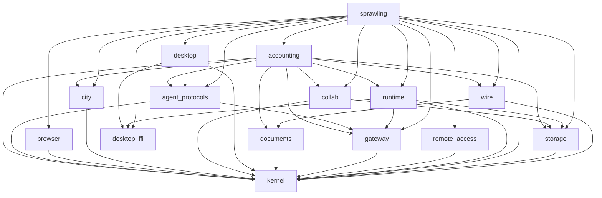
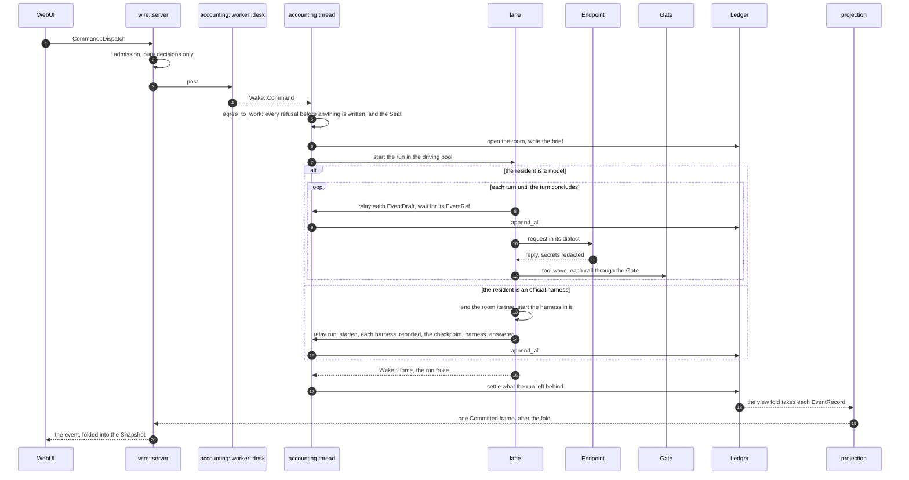
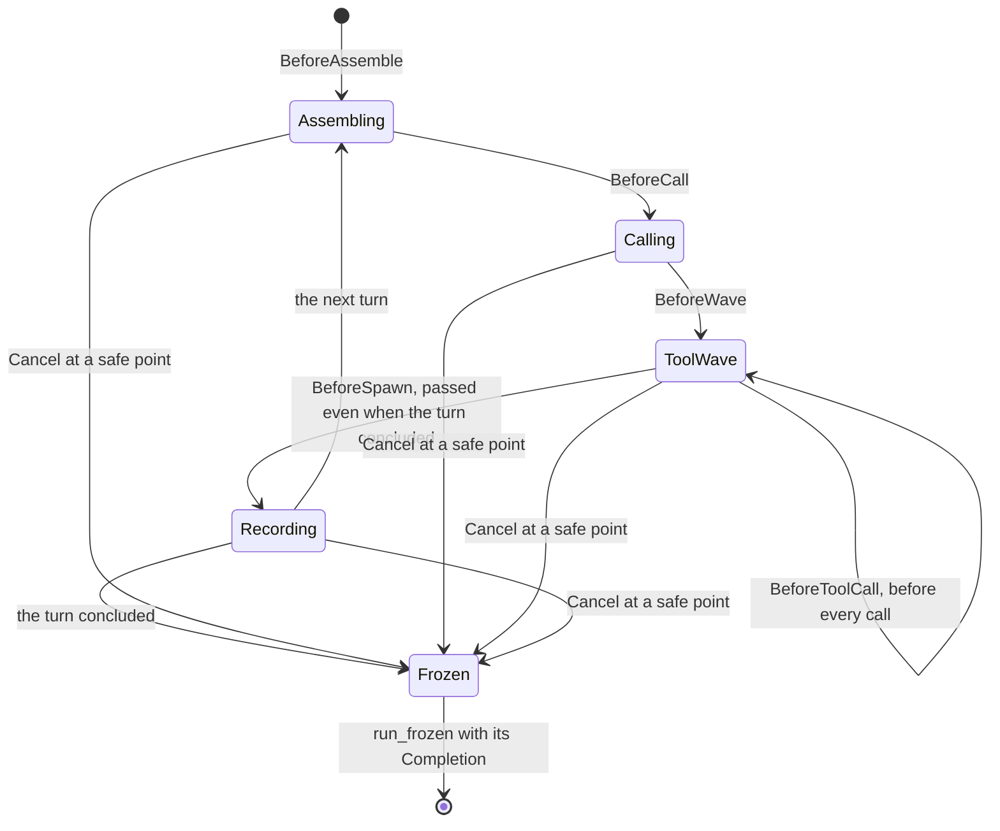
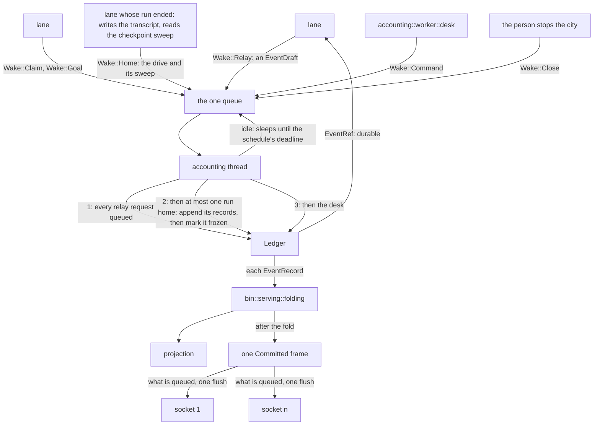
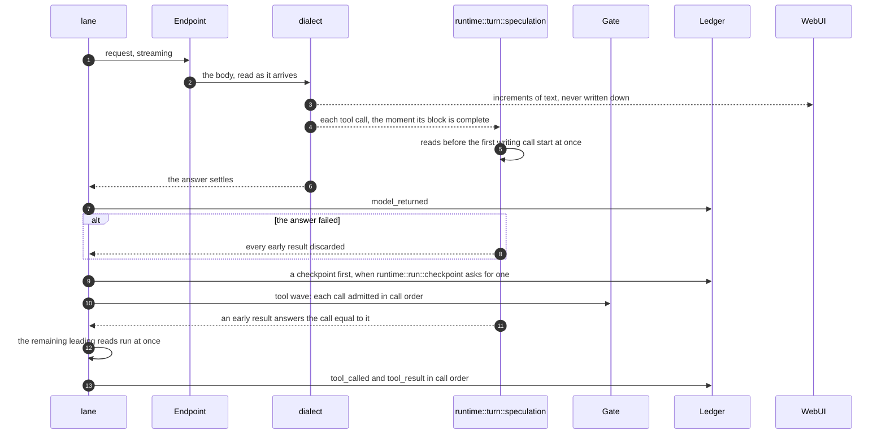
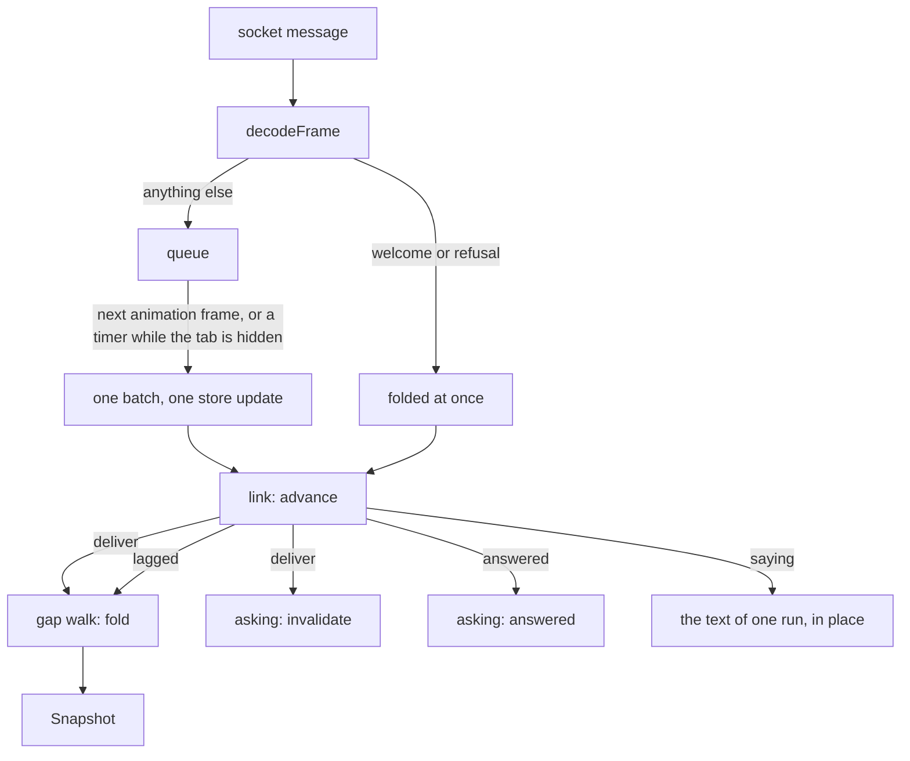

# ARCHITECTURE — sprawling

> **For someone about to change this code.** It answers what runs, how the
> units are wired, what happens end to end when one piece of work is
> dispatched, what is on disk, what crosses the wire, and how the whole thing
> is verified.
>
> It does not teach the vocabulary ([`docs/glossary.md`](docs/glossary.md)),
> install anything ([`docs/getting-started.md`](docs/getting-started.md)),
> list the rules a change must satisfy
> ([`docs/CONTRIBUTING.md`](docs/CONTRIBUTING.md)), or explain how to swap a
> provider ([`docs/operating.md`](docs/operating.md)).
>
> **What is written here is what is true across modules today.** A rule that
> governs one module lives in that module's SPEC and its rustdoc; the history
> of a decision — what was tried, what was rejected, what a gate once caught —
> lives beside the thing it constrains, so that removing the thing removes the
> record (§12).
>
> **Three kinds of statement, and you can tell them apart.** A figure between
> `xtask:begin` and `xtask:end` markers is written from the code by
> `cargo xtask docnum` and cannot drift. A table marked **machine authority**
> is parsed by a gate, so a disagreement between it and the code is a red
> build. Everything else is prose a person maintains: true when written, and
> checked by review alone — when it contradicts the code, the code is right.

## 1 What runs

One process serves one page, and the page is inside the binary rather than
beside it: `crates/sprawling/build.rs` compresses `crates/sprawling/web-dist` and emits
an `include_bytes!` entry per file, so a server that started has no asset
directory left to lose. The page is `client/`: Svelte and Effect, bundled by
Vite and driven by bun (§2).

**The wire is the seam, not the language.** A second client written against
`wire::frames` in any language is a supported thing to build; what the
shipped one happens to be written in is a replaceable fact.

```
                      one machine
┌──────────────────────────────────────────────────────────────┐
│  sprawling (one binary)                                      │
│                                                              │
│   bin::assembly                                              │
│        │                                                     │
│        ├── accounting                                        │
│        ├── runtime                                           │
│        ├── collab                                            │
│        ├── city                                              │
│        ├── browser                                           │
│        ├── documents                                         │
│        ├── agent_protocols                                   │
│        ├── remote_access                                     │
│        ├── desktop                                           │
│        ├── storage                                           │
│        ├── gateway                                           │
│        └── wire                                              │
│             │                                                │
│             ▼                                                │
│       client (TypeScript, served from inside the binary)     │
└──────────────────────────────────────────────────────────────┘
        │                                    │
        ▼                                    ▼
   the city directory                 model providers and HTTP MCP servers,
   (a tree on this disk)              through gateway; stdio MCP servers
                                      and official harnesses, as children
```

The figure draws the units and how they are wired, and nothing about what
each is for. That is stated once, in the `[family.*]` table of
`architecture.toml`, which `crates/README.md` renders as its crate table
(`cargo xtask docnum`); a second hand-kept list of duties here would drift
from it. `kernel` is absent from the figure because everything above depends
on it and nothing it holds is reached from outside the process.

The address the server binds is `kernel::consts_policy::DEFAULT_AT` unless a
caller overrides it. The value is not repeated here: every verb's default and
the first-run screen read that one constant, and `README.md` sends a person
to the address the console prints rather than spelling it, because the
address a person is told and the address actually bound may not be two
spellings (`crates/sprawling/Spec.lean` §8-2b).

## 2 The stack, and what each choice costs

The pinned versions live in `Cargo.toml`, which is the authority; this
table says **why** each choice is there and what it costs. Version numbers
are deliberately absent — a reader who needs one reads the manifest, and a
number repeated here would be a second home for a fact Dependabot moves
every week.

| Concern | Choice | Why it, and what it costs |
|---|---|---|
| Language | Rust, edition 2024, toolchain pinned in `rust-toolchain.toml`, the oldest supported compiler in `Cargo.toml`'s `rust-version` | The invariants this design cares about are expressible as types, and `#![forbid(unsafe_code)]` holds workspace-wide. Cost: compile times, and a client that has to be built before the binary that embeds it. |
| Async runtime | `tokio`, only in `wire` and the binary | The turn loop is synchronous on purpose — a decision that awaits is a decision that interleaves. Async stops at the process boundary. Cost: one blocking HTTP call per model request, paid inside a worker rather than a reactor. |
| Inbound WebSocket | `axum` with its `ws` feature (`crates/wire/Cargo.toml`; `crates/sprawling/Cargo.toml` for the remote listener) | It carries the WebSocket implementation itself, so the served protocol has one version authority rather than two. |
| Outbound WebSocket | `tokio-tungstenite`, no default features | A client rather than a server: it drives the browser over WebDriver BiDi and is what an integration test speaks the wire with. TLS termination is deliberately not here — a face reachable beyond this machine refuses to serve without a credential, so certificates stay the proxy's (`crates/wire/Spec.lean` §8-41). |
| HTTP client | `reqwest`, blocking, `rustls`, no default features | One client for the whole workspace: providers and HTTP-reached MCP servers. Two clients would mean two TLS stacks in one binary. The TLS backend is aws-lc-rs, installed once by `gateway::reach::tls`. |
| Client | Svelte and Effect, bundled by Vite, driven by bun | Its runtime dependencies are exactly the list `RUNTIME` in `tools/xtask/src/npm.rs`, each admitted under `client/Spec.lean` §7-9, and no framework runtime beyond Svelte. Svelte compiles its templates away; Effect decodes the wire with `Schema` and carries the client's few effectful steps. Cost: a JavaScript toolchain has to be present to build the page the binary embeds. |
| History | JSONL segments, appended, chain-verified | A history a person can read with `tail` and a machine can verify byte by byte. Cost: the Ledger's throughput is the city's throughput (§11). |
| Content store | BLAKE3 | One hash for the whole library: content addressing and `IdemKey` derivation. Identical content is stored once. |
| Restoration | `git2`, vendored libgit2 | Git is the restoration authority for tracked files, so a discarded file points at a checkpoint commit. Also one worktree per reviewing run. Cost: a C library in the tree, vendored so there is no system dependency. |
| Sandbox | `wasmtime` + `wasmtime-wasi`, wasip1 only | Fuel-metered execution with **no socket host implementation** — the Python arm's mechanical proof that it cannot reach the network. Cost: an optional feature; a build without it refuses tool execution in three parts rather than pretending. |
| Credentials | `keyring-core` with one store crate per platform (platform credential service), `secrecy`, `zeroize` | Plaintext lives in the operating system's own vault, never in a file we wrote. The only credential the city takes is a key a person hands it: it signs in to no subscription. |
| Entropy | `getrandom` | OS entropy for values a stranger must not guess: the door's pairing key, and the salt and nonce of the encrypted vault file. No decision path reads it, so replay never needs it (§10 rule 4). |
| Serialisation | `serde`, `serde_json`, `toml` | JSON on the wire and in the Ledger because the receiver may be a browser and a person still has to read it. TOML for configuration a person edits. |
| Errors | `thiserror` | One error shape, `AxError`, defined in `kernel::error` and mapped at every crate boundary. |
| Release profile | `opt-level = 3`, `lto = "fat"`, one codegen unit, symbols stripped, `panic = "abort"` | Crash-only delivery: there is no unwinding path to maintain, because there is nothing to catch. `3` rather than `"z"` or `"s"` because it is the fastest of the three on the product's common operations, and runtime speed comes before size; the criterion and the readings sit beside the setting in `Cargo.toml`. |
| Dependency count | <!-- xtask:begin dependency_count -->463<!-- xtask:end --> packages in `Cargo.lock` | The one number in this table that is a fact about the whole graph rather than about one choice. Listed by `sprawling status --deps`, licence-checked one by one by `cargo deny` against `deny.toml`. |

**Verification tools**, kept out of the shipped binary: `proptest`
(properties before examples), `insta` (golden output), `trybuild` (proof
that something cannot be expressed), `kani` (bounded proof, Linux CI),
`cargo-mutants` (do the tests bite), `cargo-fuzz` (parsers against hostile
bytes).

**A second compiled language is admitted by rule, not by taste.** This is
a ruling of the person. Safe Rust comes first; Zig comes next, and only for
a hot leaf where a benchmark shows it clearly faster than the safe Rust
version, or where the alternative would be `unsafe` Rust (FFI, SIMD, raw
memory); `unsafe` Rust comes last. Domain rules stay in Rust whichever
language computes a leaf. A Zig leaf enters the tree for one of two
reasons. A **hot leaf** enters only when all six conditions below hold at
once. A **platform leaf** — Win32 calls with no admitted safe interface,
where the alternative is `unsafe` Rust — enters without conditions 1 to
3, which measure speed it does not claim, and holds 4 to 6, with its
boundary properties proved in Lean and each `extern` call named in its
SPEC (AGENTS.md, Rust; the desktop's leaf is `crates/desktop/Spec.lean` section
8-12):

1. the hot spot has a production caller, and `just bench` or citysim
   measures it as a real share of a latency a person or an agent sees;
2. the safe Rust version, including reviewed crates already in
   `Cargo.lock`, has been optimised and measured to its floor on the same
   harness;
3. under the product's own release profile, on every target in the
   release matrix, the Zig version beats that floor by a clear margin that
   survives the FFI call the compiler cannot inline;
4. each call hands over a whole buffer as `(ptr, len)`, never one entry at
   a time;
5. every workflow that compiles the workspace installs the pinned Zig, the
   `header`, `length` and `modmap` gates read `.zig` files, and
   `zig fmt --check` runs beside `cargo fmt --check`;
6. the Zig tests run under `ReleaseSafe`, with a fuzz target that actually
   runs, from a corpus or under `--fuzz`, beside a property-based
   equivalence suite against a Rust reference.

The parameter that made this rule right is a measurement: on byte
scanning of ledger envelopes, safe Rust runs level with or faster than Zig
`ReleaseFast`, so a Zig leaf there would cost a toolchain in every
workflow and buy nothing. When a leaf measures the other way, re-argue the
rule.

## 3 The units and the dependency law

Crates are not a reuse mechanism here. They exist so that **the dependency
rules are executed by the compiler**: the wall `pub(crate)` builds is drawn
at the crate boundary, so each crate is a wall that actually closes.

The block below is the **machine authority** for those walls, read by
`cargo xtask depmap`. Actual edges must be a *subset* of it, so a hidden
edge is a red build rather than a discovery. It is also the unit list:
counting its rows is how you learn how many there are, which is why no
number appears in this sentence.

```depmap
kernel:
storage: kernel
gateway: kernel
runtime: kernel, storage, gateway, desktop_ffi
collab: kernel, storage
city: kernel
browser: kernel
documents: kernel
agent_protocols: kernel, gateway
wire: kernel, documents
remote_access: kernel
accounting: kernel, storage, gateway, runtime, collab, city, agent_protocols, wire, documents
sprawling: kernel, storage, gateway, runtime, collab, city, browser, agent_protocols, wire, accounting, desktop, desktop_ffi, remote_access
desktop: kernel, agent_protocols, desktop_ffi
desktop_ffi:
```

The `desktop_ffi` row is the desktop server's FFI seam (`crates/desktop/ffi`),
the one member whose lint table is its own: it is the workspace's table with
`unsafe_code` at `deny`, so each call into its Zig leaf can relax the lint at
that one statement (`crates/desktop/Spec.lean` D14). `sprawling` and `runtime` read it for the
processor topology, the power-throttling opt-out and a job's CPU weight and
memory limit, which no safe crate offers (`crates/desktop/ffi/Spec.lean` D4). `desktop` reads `kernel`
and `agent_protocols` for four facts the city defines, the error codes, the
image quality domain, the MCP revision and the effect-unknown key, and for
nothing else.

Inside one crate the compiler sees no layering: `sprawling` builds as one
unit whichever way its modules name each other. The block below is the
machine authority for the direction of the edges that matter there, also
read by `cargo xtask depmap`. Each line names a module and the paths its
production code never names; tests may still build a fixture through the
assembly point. `bin::assembly` knows every concrete type, so the modules
it assembles never name it back (`crates/sprawling/Spec.lean` §8-92).

```directions
crates/accounting/src/views: crate::worker
crates/sprawling/src/doctor: crate::assembly, accounting::worker
crates/sprawling/src/serving: crate::assembly, accounting::worker
```

What each unit owns is stated once, in the `[family.*]` table of
`architecture.toml`, and not repeated here, because two hand-kept lists of
duties drift apart. §13 draws this block as a graph, generated from it.

**Three rules.** Dependencies point inward, and never back. A seam declares
its trait in the inner layer and implements it in the outer one, so
`kernel` can define what a Ledger *is* without knowing where it is written.
And splitting into crates buys compiler-enforced layering, not reuse —
nothing here is published.

**Three kinds of edge**, and telling them apart is what makes the
repository readable:

| Edge | When it exists | Example |
|---|---|---|
| Dependency | compile time | `runtime → kernel` |
| Assembly | run time, only in `bin::assembly` | the upload sink in `wire::server` receiving `storage::cas` |
| Event | anywhere a `kernel::Ledger` handle is held | writing `tool_result` after a tool runs |

Below the binary each crate that holds a domain uses at most two others:
`runtime` and `collab` each use `kernel` and `storage`, and `agent_protocols` uses
`kernel` and `gateway` (an MCP server reached over HTTP gets its client
from `gateway::client_for`, the one place a client is built), and `desktop`
uses `kernel` and `agent_protocols` beside its own FFI seam. The `depmap`
block also lets `runtime` use `gateway`, and the code does not take that
edge. `accounting` uses eight, because it holds the city's one writer,
the views every page is answered from, and the ports the writer reaches
outside itself through, and those carry the other crates' types;
`sprawling` uses every crate. A crate may **use**
the interfaces of what it depends on and nothing more; the moment a
module starts passing concrete types between two of them, that edge
moves up into the assembly layer.

`xtask` and `citysim` are workspace members outside the product graph.
**citysim drives the turn loop a second time**: `runtime::run::drive` with
simulated adapters — a scripted model, scripted tools, an in-memory Ledger
— which is how a script reproduces a run. The worker a script would drive
to reproduce a whole dispatch lives in `accounting`:
`accounting::worker::RunWorker` receives this machine through one
`Hands` value, its model adapters through `accounting::ModelFactory` and
its MCP servers through `accounting::Connectors`, and
`bin::assembly::production::hands` is the one place the production value
is made. Integration tests drive a dispatch against scripted ports by the
same door `wire::server` uses. citysim depends on `sprawling` only for
its two bench binaries, which time the product's own startup and queries;
its scenario library drives `runtime::run::drive`, and no scenario hands
the worker a scripted `Hands` yet.

## 4 Seams

A seam is a trait declared in the inner layer and implemented outside it.
**One adapter is a hypothetical seam; two make it real** — so every seam
ships with a second implementation.

This table is a **machine authority**: `cargo xtask depmap` refuses a
`pub trait` declared anywhere but the files it names.

| Seam | Declared in | Production adapter | Second adapter |
|---|---|---|---|
| `kernel::ledger` | crates/kernel/src/ledger.rs | memory: jsonl segments with tail recovery | citysim: in-memory Ledger |
| `kernel::tool` | crates/kernel/src/tool.rs | runtime tools, collab tools, browser, protocol | citysim: scripted tools |
| `kernel::model` | crates/kernel/src/model.rs | gateway: native and endpoint | citysim: scripted model |
| `runtime::sandbox` | crates/runtime/src/sandbox.rs | wasmtime with fuel metering | pass-through and fault doubles |
| `runtime::turn::wave` | crates/runtime/src/turn/wave.rs | sprawling: a run's bench in three stages, `accounting::worker::driving::placing` | any `FnMut(&ToolCall, TimeMs)`, which answers as it admits and so runs a wave serially: citysim and the scripted-tool tests |
| `browser::port` | crates/browser/src/port.rs | WebDriver BiDi session layer | two shipped transports and an offline replay |
| `remote_access::route` | crates/remote_access/src/route.rs | `route::cloudflare`: a locally managed Cloudflare named tunnel; `route::command`: a command the person wrote | `route::scripted`: a fixed address, and the order it was opened and closed in |
| `agent_protocols::mcp` | crates/agent_protocols/src/mcp/outbound.rs | stdio child process, HTTP, or SSE | `ScriptedOutbound` for offline replay |
| `accounting::models` | crates/accounting/src/models.rs | `accounting::worker::models`: the endpoint book's adapters | the scripted factory in `crates/sprawling/tests/model_factory.rs` |
| `accounting::clock` | crates/accounting/src/clock.rs | `bin::assembly::production::SystemClock`: the wall clock, the one sampling point, handed in through `Hands.clock` | the stopped clock in `crates/sprawling/tests/clock.rs` |
| `accounting::connectors` | crates/accounting/src/connectors.rs | `accounting::worker::mcp`: the stdio, HTTP and SSE links a building's `[[mcp]]` tables name | the scripted connectors in `crates/sprawling/tests/connectors.rs` |
| `accounting::machine` | crates/accounting/src/machine.rs | `bin::doctor::ThisMachine`: the doctor's report and its one install runner, handed in through `Hands.machine` | the scripted machine in `crates/sprawling/tests/machine.rs` |
| `accounting::views::snapshot::start` | crates/accounting/src/views/snapshot/start.rs | `accounting::views::Views`: the fold every page is answered from | `accounting::worker::folds::standing_start`: the standing a worker judges from |

The *second adapter* column has no checker: a seam whose double was
deleted would still read as real here. That is a known hole, not a
guarantee.

**Two inner seams** stay `pub(crate)` because nothing outside their crate
needs them: `storage`'s `Vfs` (real filesystem / deterministic power-loss
model) and `gateway`'s `Vault` (platform credential service / in-session
store).

**Deliberately not seams**: `gateway::dialect` is a pure function and needs
no trait; the internals of `city` and `collab` have one
implementation each and are driven from outside by citysim; `git2` is used
directly, because an interface with one implementation is decoration.

## 5 One dispatch, end to end

This is the path everything else supports. Following it once explains more
than any diagram of boxes.

1. **The page sends a Command.** A person fills in the control surface —
   address, what to produce, what counts as done — and the client's socket
   sends `Command::Dispatch` over the WebSocket. The frame carries no
   ceiling of any kind: nobody can price a piece of work before it runs,
   and the one brake is `Halt`.
2. **`wire::server` decides whether to accept it.** Two pure
   judgements — may this address be bound, may this peer be accepted — with
   the socket code that surrounds them making no judgement at all.
3. **`bin::assembly` turns it into work.** This is the only place that
   samples the clock, so the timestamp enters as a parameter from here on.
   A worker takes the dispatch and answers every refusal it can owe before
   it writes anything: the reserved subtree, a halted scope, rules that
   will not load, and a tag with no model behind it are all decided by
   `agree_to_work`, which writes nothing. **Opening the room is
   the first thing this city puts on disk for a dispatch**, so work nobody
   could take leaves no room behind for a person to find.
4. **The city writes `run_started` before anything happens.** Every effect
   becomes an event first; that ordering is the design's load-bearing rule,
   not a logging preference. A tool that only reads (`Effect::Read`) runs
   before its `tool_called` is durable. The lines a run appends are its
   held lines (`runtime::turn::ledger::HeldLines`): they belong to the run
   rather than to one turn, and every one of them is durable before the
   next outside effect. One barrier after `model_called` covers the model
   call and the previous turn's wave; a write's `tool_called` is durable
   before the write runs; and the run pays one more before it freezes, is
   cancelled, or writes a carrier event, so a carrier line never lands
   ahead of what the run held. A turn therefore pays one barrier plus one
   per write, seq stays the order of appending, and a power cut at any
   line leaves a prefix with no write ahead of its intent
   (runtime D24 and D36, `crates/runtime/spec/Turn/Durability.lean`).
5. **`runtime::prefix` assembles the frozen prefix** in four segments —
   city, building, resident, run — from `city::spine_files`, `city::policy`
   and `city::resident`. Assembling it is itself an event, and the result
   is frozen for the whole run.
6. **`runtime::catalog` decides what the model may see**: the built-in
   tools, the collaboration tools this building admits, the skills
   its reading room allows, and any MCP tools discovered from the
   building's `CONFIG.toml`. Of those, only the mode's core travels as
   tools; the rest is one line each in a dormant index of at most 1 KiB,
   and a run fetches a guide with `describe` and runs a dormant tool
   through `call` (the truncation lock, `crates/runtime/Spec.lean` §8-60).
   `city::neighbourhood` is scanned in the same
   breath, so the run also knows which addresses it can reach and who
   stands at them — without it, `signal` takes an address the model has to
   have been told.
7. **`runtime::turn` enters its typestate**: Assembling → Calling →
   ToolWave → Recording. `runtime::run::SafePoint` names where a cancel is
   heard: before each of those four boundaries, and before every call of a
   tool wave. An interruption inside a phase cannot be spelled.
8. **`gateway` makes the call.** `gateway::router` picks the endpoint
   attached to this tag; `gateway::dialect` translates the canonical
   Anthropic-shaped conversation into the provider's dialect;
   `gateway::credential` redeems a `secret:realm/name` reference into a
   header at the last moment. Each endpoint hands out permits in arrival
   order under its `max_in_flight`, and `gateway::concurrency` narrows it
   after a 429 until the provider's `Retry-After` instant has passed; this
   provider queue is the one concurrency limit, because the driving pool
   sets no lane count (`crates/gateway/Spec.lean` §8-6,
   `crates/sprawling/Spec.lean` D34). Each endpoint keeps one HTTP client,
   so its connections stay open between calls, and a request to
   `api.openai.com` carries the conversation's id as `prompt_cache_key`,
   so the provider can route the turns of one conversation to one cache
   (gateway D25). The city opens no connection before the first call and
   speaks no WebSocket to a provider; `crates/gateway/Spec.lean` §3 names
   the evidence that would add either.
9. **The reply is scanned before it is recorded.** `runtime::redact` puts
   model output through the same secret scan as everything else, so a key a
   model repeated does not become permanent.
10. **Tools run behind gates.** `kernel::gate` answers with an exhaustive
    verdict — allowed, refused in three parts, or escalated to a person.
    `runtime::run::checkpoint` decides whether a wave needs a git checkpoint first,
    `storage::checkpoint` commits the checkpoint and scans the worktree after the
    wave, and anything that disappeared becomes a `file_discarded` event
    carrying the way back. Runs checkpoint at the same time: each writer
    builds its tree in an index of its own, and only the object store and
    the move of HEAD are shared, the latter under one lock that guards
    HEAD alone (storage D25, D26). The scan never opens a file another
    writer is still staging, so a document mid-write or a landing's
    `.part` file is not read as the building's content (storage D30).
11. **The result comes back shaped.** `runtime::pipeline` builds the result
    envelope — clock stamp, network reminder, any steer a person sent — and
    `runtime::compaction` shortens what is too long, always reporting how
    much it dropped.
12. **Everything lands in the Ledger, and the views follow.**
    `storage::hot` and `storage::attribution` fold the same event stream into
    what the pages ask for. The views fold each record on their own thread
    (`bin::serving::folding`), and only then is it broadcast to every socket
    as one `Committed` frame, so a page that asks right after an event
    arrives is answered from views that already hold it. A socket worker
    that wakes writes every record already queued for it, each as its own
    `Event` frame, and flushes once, so a burst costs one flush rather than
    one per record; frames keep their shape and their `seq` order
    (`crates/wire/spec/Server/Socket.lean` §8-47h, wire D45). The client folds
    the event into what it believes. The same fold, on both sides of the
    wire.
13. **A signal reaches whoever it names, working or not, when it is sent.**
    `signal send` is recorded at the call (`signal_enqueued`, through the
    lane's relay), and the accounting thread delivers it into the named
    room as it shows that line, then records where it landed as the
    `signal_landed` line that follows: delivered, queued or knocked
    (kernel D38). A run working in that room receives it at its next safe
    point, through the same door a steer uses, as one *letter*: an escaped
    `<letter>` element that names the sending room, the sending run, the
    kind and the sender run's state at delivery (running for a send,
    frozen or cancelled for a handback), which its body cannot close
    (collab D16); a room with no run is *knocked* at that delivery, once, while the sender
    still drives — `bin::assembly` starts a run whose brief names the
    resident who spoke, or waits for the room's current reader to leave.
    The sender carries on. A signal counts as consumed only when a model
    answer that read it is recorded; a run that leaves before that gives
    it back and the room is knocked again. Work handed down with
    `delegate` or laid out with `workshop` starts at the call, while the
    parent still drives. A `signal send` with `wait: true` stops the
    sending run at its next `BeforeAssemble` safe point with no model
    call, until a signal from the room it spoke to arrives in its
    mailslot, the injected clock reaches the stop's reading plus
    `collab::signal_tool::PATIENCE_MS` (240 s), or the run is stopped;
    `signal_wait_started` and `signal_wait_ended` record it, and the end
    lands in the next request as a steer (collab D9). Who speaks is a type,
    `runtime::conversation::Speaker`: only the person's own entrance
    renders as `user`, the city's own words as `city`, and a resident's as
    a letter; a delegated child's JOB.md names who handed its task down
    (city D21). A knock addresses a resident, never a
    frozen run: history is read, not woken. (collab D7–D11,
    `crates/collab/spec/Delivery.lean`.)

When the process dies mid-call, `sprawling resume` verifies the chain,
closes tool calls whose outcome was lost as *unknown* rather than as
failed, and reports what waits for a person.

**A room whose resident is an official harness takes the second drive.**
`agree_to_work` decides the resident once, as a `Seat`, and a harness
room leaves the walk after step 4: steps 5 to 11 are the harness's own,
because it assembles its own context, calls its own model and runs its
own tools, so the city records what it chooses to report and governs
none of it. The lane lends the room its own worktree whatever the
building's `review` says, starts the harness there
(`accounting::worker::driving::harness`), sends the brief as its one
prompt, books each report as `harness_reported` after it was said, and
turns a halt or the building's `harness_minutes` ceiling into
`cancel_received` and `session/cancel`. When the harness answers, the
city commits the tree, writes `harness_answered`, and freezes through
`runtime::run::harness`, the one author of that order; a run frozen done
is offered for review as a request the city opens, because the harness
reaches none of the city's tools, and the merge stays the one way its
writes reach the building. That is the weak form of step 4 which
`crates/sprawling/Spec.lean` §8-4e records and
`crates/agent_protocols/spec/Harness/Session.lean` proves.

### When it does not go through

The walk above is the path that succeeds. Every way it can stop is one
shape, and that shape is a type rather than a convention.

**A failure that does not say what to do next cannot be spelled.**
`AxError` carries seven wire fields in declaration order — which is rule 6
of §10, so an error is as replayable as an event: a stable `code`, the
`action` and `subject` it failed on, `nearby` candidates, a `recovery`
sentence, whether it may be sent again (`retry`: yes, no, or unknown when
the request left and its answer was lost), and the gate's own refusal when
a gate is what stopped it. **The model is the audience**, so `nearby` and
`recovery` hold directly executable information rather than apologies. Both
constructors return an `ErrorDraft`, and `with_recovery` is the only way
across to an `AxError` — a failure with no next step is unconstructible,
not merely discouraged.

**A gate answers one of exactly three ways.** `GateOutcome` is `Allow`,
`Deny` carrying the refusal, or `Ask` carrying the question. Every caller
decides all three, so a door that *starts* asking a person is a compile
error at every call site rather than a behaviour that changes underneath
them. Exactly one door answers `Ask` today, and the refusal conformance
matrix asserts that count rather than trusting it. The roster of doors is
data (`kernel::gate::DOORS`), so a door added to the enum is a door the
matrix judges, and one without a sample does not compile.

**A refusal has three parts**: `rule` — what the rule is; `violation` —
what broke it; `alternative` — what to do instead. These are the same
three parts every gate in `xtask` reports, because a refusal a person reads
and a refusal a builder reads are one shape, not two.

**A halt names a scope, never a run**: the city, a building, or a
workshop. A frozen run is history, and history is read rather than woken.

## 6 On disk

A city is one directory. Copy it and it is the same city; delete it and
nothing outside it changes.

The tree below is the **trunk, not the full set**. Every path this product
writes is derived by `kernel::layout` from a city root and an address, and
that module is the authority; drawing the complete list here would be a
second home for it, and the one a person reads would be the one that went
stale.

```
<city>/
├─ .sprawling/                 the city's own reserved subtree
│  ├─ ledger/                  the only history — jsonl segments, appended, chain-verified
│  ├─ cas/                     content-addressed store, BLAKE3, one copy per content
│  ├─ worktrees/               one git worktree per reviewing run, objects shared
│  ├─ library/                 skills more than one building admits
│  ├─ snapshot/                what an open resumes the views from, so it folds only the tail
│  ├─ remote/                  the remote gate's own state
│  │  └─ devices.toml         the devices paired to reach this city from outside the machine
│  ├─ CONFIG.toml              city layer of the three-layer configuration
│  ├─ MONITOR.toml             the sampling beat the performance page last set
│  └─ FILTERS.toml             what this scope keeps out of a transcript
└─ <building>/                 one building, one line of business
   ├─ .sprawling/              the building's reserved subtree: what governs it
   │  ├─ RULES.toml            what the building is and may do: one parsed file
   │  ├─ CONFIG.toml           building layer, including its MCP servers
   │  ├─ skills/               skills only this building admits
   │  └─ sessions/             the Ledger's projection of what ran here, disposable
   ├─ Roadmap.md               the plan tree, and the denominator of every progress reading
   ├─ Memo.md                  decisions and corrections
   ├─ Handoff.md               what the next session needs
   ├─ Archive/                 work this building has finished with, by kind and day
   └─ <room>/                  one session's workplace, named by the person who started it
      ├─ URBANITE.md           who this resident is and how it works
      └─ JOB.md                the task for this session
```

**One rule, applied at every scope: what governs a scope lives in that
scope's `.sprawling/`, and no write domain reaches it.** `is_reserved`
answers true for an address with `.sprawling` or `.git` in any segment,
compared without ASCII case (`kernel::address::PROTECTED_METADATA`), so the
check is one predicate in `kernel::address` rather than a list of protected
file names. An agent therefore cannot edit its own accounting, its own
configuration, its own building's rules, or the history of what it did.

A run's write domain is what its building's `RULES.toml` declares, and
**the whole building when it names no prefix** — which is the shipped
template. The room is where a session works, not the boundary that
contains it.

The run policy a dispatch chooses only narrows that domain. Under the
`create` write limit a run creates files that do not exist and changes
none that do, and the check is made by the filesystem at the moment of
the write, so two racing creates of one name land once. An `experiment`
run writes in a worktree of its own even in a building without review,
and nothing in that tree is merged.

**`Roadmap.md` is a tree, and the `plan` tool is what writes it.** The
index column is a path — `2.3.1` hangs under `2.3` — so one file states a
multi-level plan without a second file to say how the levels relate.
`Weight` is a ratio among the rows sharing a parent and `Needs` names what
must finish first, which is what makes a ready set computable. A resident
divides its own branch and cannot reach past it: `kernel::share` has no
constructor, so a share exists only by dividing another one, and the total
is the whole plan whatever the plan turns into. Only leaves are counted; a
branch's work is its children.

## 7 The wire

One WebSocket, three kinds of frame, and a schema hash that both ends check
on connect: a page from a different build refuses rather than misreads.
`WIRE_V` is <!-- xtask:begin wire_v -->58<!-- xtask:end -->.

| Frame | Count | What it is |
|---|---|---|
| `Command` | <!-- xtask:begin command_frames -->42<!-- xtask:end --> | something a person wants done: dispatch, steer, cancel, approve, halt, raise a building, attach an endpoint, set a goal the city works towards, write a document that governs the city |
| `Query` | <!-- xtask:begin query_frames -->56<!-- xtask:end --> | something a page wants to know: the city, one run, approvals, cost, the ledger, archive, discards, inboxes, which run wrote a commit, who answers and what was answered for the person, and one file's patch text |
| `Delta` | — | what a model is saying while it is still saying it: no sequence number, never written down, and a client that missed one has lost nothing |
| `Event` | the Ledger's own kinds | what happened, pushed as it happens |

A `dispatch` carries the run policy — mode, write limit, admission
requirement, landing policy — as one value, and the city writes that same
value into the run's `run_started` line, so what a person chose is read
back from the Ledger rather than inferred.

How often each skill and each tool server was used is a question the
Ledger answers, not a counter the city keeps: `Query::SkillUsage`,
`Query::McpUsage` and `Query::UsageExport` fold the whole Ledger when they
are asked (`accounting::views::usage`, accounting D49). A skill use is a
`describe` or `read` of a skill that the run's `run_started` pinned by
name and hash; a tool server use is a `tool_called` line whose effect
names the server's label, so a server removed from a building's
`CONFIG.toml` keeps its history (wire D33). The answer stays cached until
a run freezes or a skill is audited, and the export is JSONL or CSV.

Two properties are worth stating because they are enforced by types rather
than by review. A `Command` carrying a credential **cannot be serialised**:
`Sealed<T>` has no `Serialize`, and the `PutSecret` payload of the remote
command type is an uninhabited type, so entering a key over the network is
not a request that can be spelled. And every `Query` must be answered
exhaustively — the answer match has no catch-all, so adding a query without
answering it does not compile.

## 8 Where to change what

Each crate's SPEC settles the interface of its own modules; this table gives
only the first hop for each kind of change, so that nobody has to read a
hundred module rows to find which SPEC to open.

The third column names what turns red when the change is wrong — which is
the part worth knowing before starting, not after.

| To change this | Go here | Held by |
|---|---|---|
| a new event kind, or a payload | `kernel::event` + `crates/kernel/spec/Event/Kind.lean` | the kind set is closed; `storage` fixtures compare bytes across platforms |
| a new `Command` or `Query` frame | `wire::frames` + `crates/wire/Spec.lean` | the new name moves the schema hash, so an older page is refused at the handshake; `WIRE_V` rises only when a frame changes shape while every name stays (wire D1); every `Query` must be answered or it does not compile |
| what a model may call | `runtime::catalog`, tools in `runtime` or `collab` | `kernel::tool` is the seam; a tool with no conformance suite is not a seam |
| how a provider is spoken to | `gateway::dialect` + `crates/gateway/Spec.lean` | a pure two-way translation with the canonical shape in the middle |
| a known provider host | `gateway::provider::preset` | a table with data and no branches, each row citing its source |
| an official harness, or how one starts | `agent_protocols::harness::roster` + `crates/agent_protocols/Spec.lean` §8-19 | the roster is the person's ruling; each start command is pinned to the version the ACP registry names, which `docs/third-party.md` §1 watches |
| what a harness run may do in a room | `accounting::worker::driving::harness` + `crates/sprawling/spec/Accounting/Worker.lean` §8-4e | `runtime::run::harness` is the one author of the order a harness run writes; `crates/agent_protocols/spec/Harness/Session.lean` proves it |
| how a key is kept and redeemed | `gateway::credential` | plaintext may reach only the platform vault; `secret` gate reads every boundary |
| where a city keeps a file | `kernel::layout` | the reserved subtree is out of every write domain, by one predicate in `kernel::address` |
| what a building may do | `city::policy` (`RULES.toml`) + `crates/city/Spec.lean` | a run's write domain is what its building declares |
| the documents a building is raised with | `crates/city/templates/` + `city::building::template` | compiled in with `include_str!`, so a moved template breaks the build; laying out a confidential building is refused when the line its template flips is gone |
| how a host command is confined | `runtime::tools::exec::confinement` + `crates/runtime/spec/Tools/Exec.lean` | every arm states all five guarantees, so a new axis is a compile error in each arm |
| the Windows desktop a resident may drive | `crates/desktop` + `crates/desktop/Spec.lean` | `unsafe` only in `crates/desktop/ffi`, under the Zig rule of §2; `xtask guard` holds its lint table |
| a crate depending on another | the `depmap` block in §3 | actual edges must be a subset; a hidden edge is a red build |
| a new seam | §4, and the trait's file | `depmap` refuses a `pub trait` outside the files §4 names |
| a new module, or a deleted one | `architecture.toml` | `modmap` refuses a file with no entry, and an entry whose file is gone |
| a platform the release ships | `xtask::platform`'s `PLATFORMS` | one row per platform; the npm scope and the bare root name are asserted there |
| the page | `client/` + `client/Spec.lean` | its own lint, typecheck and tests; the bundle is measured against a byte budget |
| the page's colours, motion or words | `client/src/theme.css`, `client/src/lang.json` + `docs/frontend-method.md` | `xtask color`, `xtask motion` and `xtask wording` refuse a colour, curve, duration or word spelled anywhere else |
| what a module must hold on every input | the part under the crate's `spec/` that names the module (§11, *Specifications in Lean*) | `just models` proves it with no `sorry`, `admit` or `axiom`; the module's rustdoc names the part |
| a gate itself | `tools/xtask/` + `tools/xtask/Spec.lean` | review asks for a `Verdict:` trailer when a gate loosens in the commit it would have refused |

Two documents sit beside this one rather than inside it: operating a
city — swapping a provider, pointing at another MCP server, running a
local model — is [`docs/operating.md`](docs/operating.md), and what a
change must satisfy before it merges is
[`docs/CONTRIBUTING.md`](docs/CONTRIBUTING.md).

## 9 Seven shapes

Every module instantiates exactly one of these. The classification earns
its place by what it catches: a module that cannot name its shape usually
holds two things that want to be separate files.

| # | Shape | The test for it |
|---|---|---|
| 1 | decision | no I/O, no clock, no global state; returns an exhaustive enum, never a bool |
| 2 | value | invariants enforced at one construction point; private fields; no setters |
| 3 | port | a trait on a seam, delivered with its conformance suite |
| 4 | adapter | thin, no policy: swapping in a second implementation changes no policy |
| 5 | typestate | phase changes enforced by types; no method returns a previous phase |
| 6 | data | data only, no branches. Editing it is editing behaviour |
| 7 | projection | folds the event stream into a view; deleting it and rebuilding gives the same bytes |

**The Humble Object is the recurring move**: the hard-to-test end is
stripped to nothing and the thick end stays pure. `runtime::watchdog`,
`gateway::endpoint` and the sandbox adapters are all instances of it.

### Making illegal states unrepresentable

Each of these is a type, not a slogan, and each has a compile-failure
counterexample in the test suite — because "unrepresentable" is itself a
claim that needs testing.

- `EventRef` has no public constructor and no serde ⇒ **a forged event reference cannot be spelled**.
- `Completion::Done` always carries `Evidence`, and `Completion` has no serde ⇒ **a deserialised "finished" cannot be spelled**.
- A `Delegate` value has no `delegate` method ⇒ **a grand-delegate cannot be spelled**; delegation is one level deep.
- `Discard`'s constructor requires a `Restoration` ⇒ **a deletion with no way back cannot be spelled**.
- `Sealed<T>` has no `Serialize` ⇒ **entering a credential remotely cannot be spelled**.
- `UnplannedProgress` has no `ratio` method ⇒ **a percentage with no denominator cannot be drawn**; there is nothing to call.
- `Share` has no constructor and no arithmetic; the only producer is `Share::split`, which consumes what it divides ⇒ **weight cannot be minted**, so a branch cannot be given more than its parent had and the total is always the whole plan.
- `Held` has one private field and two consuming methods ⇒ **a claimed plan node cannot be put down silently**: it is finished with evidence or stopped with a cause, and a run that simply ends spends it on `FrozeWithoutEvidence`.
- `Pursuit::declare` takes the depth-zero position and a `Delegate` cannot produce one ⇒ **a sub-agent cannot set the city working until the work runs out**.

These expectations are byte comparisons against a compiler's output, so the
toolchain is part of them. What to do when an installed component changes
that output is in [`docs/CONTRIBUTING.md`](docs/CONTRIBUTING.md); it is
a fact about running the tests, not about the design.

### LLM First: mechanism from the city, method from the model

The city supplies mechanism, facts and boundaries; the method and the
judgement are the model's. A tool states what exists and what it refuses,
and leaves the order of the steps to the model: the `plan` tool asks *Must
this be expanded?* in its description, which sits in the cached prefix and
so costs no latency and no spend, and a `split` reports how many children
of the node are still unfinished. There is no follow-up question, no depth
limit and no approval step on top of that.

The parameter that makes this right is that a frontier model carries out
the method reliably without help. When an eval measures a model skipping
one step systematically, re-argue this rule for that step instead of
obeying it.

## 10 Determinism and hardening

The whole city runs as real code, single-threaded, on a virtual clock,
driven by a fixed script. That is not a testing convenience — it is the
property that makes a failure replay exactly, and these seven rules are its
admission conditions. A seed is what a random scenario batch would need;
there is no random source in the simulator today to seed.

| # | Rule | Held by |
|---|---|---|
| 1 | Decision paths iterate `BTreeMap`; never a hash order | review, plus the citysim determinism scenarios |
| 2 | Time arrives as a parameter; the one sampling point is `bin::assembly` | `clippy.toml` disallowed methods |
| 3 | One spawn point | review. A library crate starts a thread in eight places, each bounded by what it serves: `gateway::endpoint::stream` gives each streamed call one detached reader; `runtime::turn::wave::reorder` runs the read-only prefix of a tool wave on scoped threads, all joined before the wave accounts a single result; `runtime::turn::speculation` runs the reads a model hands over while it is still generating on scoped threads, all joined before the model call returns; `agent_protocols::mcp::reading` gives each stdio MCP connection and each harness session one reader that ends when the far side closes its output or the caller drops the channel; `agent_protocols::mcp::sse` gives each SSE connection one reader that ends when the stream closes; `accounting::worker::pool` gives each run one lane that drives it, writes its transcript and reads its checkpoint sweep, and ends when the run comes home; `storage::chain_audit` reads a proof's segments in waves of at most eight, one scoped thread each with the calling thread as the first, and joins every wave before it walks the chain through those segments in order; and `remote_access::route::command` gives each command route one reader that ends when the command ends and its output closes. Every other thread starts in the `sprawling` crate and lives exactly as long as the run, connection or probe it serves: the accounting thread in `bin::assembly::attending`, the endpoint warm-ups that `bin::assembly::attending` starts once the city is open, one per attached endpoint, each ending with its one request, the view fold in `bin::serving::folding`, the background chain audit in `bin::assembly::chain_watch`, which proves the history once per open, the console, which `bin::assembly::remote_door` starts on the thread that first reads the city key, so a Keychain dialog nobody answers cannot hold up Ctrl-C, the remote listener's tasks in `bin::outside::listener`, which end when the remote door closes, first run, the doctor's probes, and the `sprawling-gauge` beat thread in `bin::main::gauge::running`, which reads one measured command's process tree and ends when that run does. The hot ones among them, the accounting thread, the view fold, the socket workers and each run's lane, ask the serving placement table for a **seat** as they start and give it back as they exit; *CPU placement* below says where seats come from and what each platform does with them |
| 4 | No random source on a decision path; OS entropy mints only values a stranger must not guess | review; citysim has no random source to seed |
| 5 | Execute in parallel, account in series, ordered by `seq` | the Ledger port owns `seq` and `prev` |
| 6 | Ledger payloads hold integers; timestamps are integer milliseconds; field order is declaration order | cross-OS byte fixtures |
| 7 | `IdemKey` derives from `(run, seq, normalised action)` — never from a clock or a random number | property tests |

Rules 1 and 6 together give a checkable property: **the same event sequence
replays byte-for-byte identically on any machine.** The property covers the
accounting, not the world: what replays is each external call's recorded
result, read back from the Ledger. A replay never re-executes a tool or a
model call — a changed world would diverge through no defect of the record.

**Hardening** is compile-time, workspace-wide, and identical in tests and
production except where a test module relaxes it locally: no `unwrap`,
`expect`, `panic!`, `todo!`, `unreachable!`, bare indexing or slicing;
arithmetic is checked; narrowing goes through `TryFrom`; `as` casts are
denied; `unsafe_code` is forbidden in every workspace crate but one. The
desktop server's FFI seam (`crates/desktop/ffi`) carries the workspace's
table with `unsafe_code` at `deny`, and holds one `unsafe` block per call
into the Zig leaf, each with the precondition that makes it sound
(`crates/desktop/Spec.lean` sections 8-12 and D14); `xtask guard` holds that table
to the workspace's, key by key. Money and quantities are
integer newtypes (`UsdMicros`, `Tokens`, `ByteLen`, `Seq`), and floats stay
out of every decision path.

**The most fragile point in the design is one paragraph long.** A database
handle, one `Instant::now()`, or a bare spawn inside `kernel` disables
replay, formal verification and deterministic simulation at the same time.
The gates hold that line so the property survives a builder who has never
read this file.

### CPU placement

Under heavy load the city's latency is decided by which cores its own
threads wait for. The threads that matter are the hot ones of rule 3: the
accounting thread `sprawling-runs`, which owns the Ledger and takes every
relay; the view fold `sprawling-views`; the tokio workers that serve the
sockets; and one lane per driving run. Around them stand the processes the
city starts: each run's commands, which on Windows sit in that run's Job
Object (`runtime::backlog::jobs`), and a harness resident's own process.
Placement is the policy that decides which cores the hot threads prefer
and how much of the machine the children may take. It gives hints and
soft preferences; the operating system's scheduler decides, and the city
never sets hard affinity by default (`crates/sprawling/spec/Serving/Placement.lean`
D41).

**The topology is read, never assumed.** `bin::serving::placement::reading`
reads, on each platform, every logical processor's efficiency class, its
physical core, its last-level cache group, its processor group and whether
this process may use it. Windows reads `GetSystemCpuSetInformation` through
the Zig leaf in `crates/desktop/ffi`, which only makes the call and fills a
buffer Rust lends it; safe Rust (`desktop_ffi::cpu_set`) parses the records,
and the usable set is the reading thread's group affinity, which already
counts a Job Object's limit. Linux reads `Cpus_allowed_list`, the hybrid
`cpu_core` and `cpu_atom` lists or `cpu_capacity`, and the `topology` and
`cache` entries under `/sys`. macOS reads `hw.nperflevels` and the
per-level core counts through `/usr/sbin/sysctl`. A reading that fails or
contradicts itself is reported, not guessed around (sprawling D45).

**The plan is a pure function of that reading**
(`bin::serving::placement::plan`). One usable class, or one class with
several cache groups, gives no plan: the threads are left to the operating
system, which on a dual-CCD X3D part already steers by cache, so a second
opinion would only fight it. Several classes give one seat per physical
core of the fastest class, the lowest-numbered usable logical processor of
each; the slowest class is never in the plan, and threads beyond the seats
take none and are placed by the operating system. A partial, inconsistent
or unusable topology, which is what most virtual machines report, gives no
plan. The seat table hands a starting hot thread the first free seat and
keeps it until the thread exits, so no two hot threads prefer one core and
a thread never changes preference mid-life. One step of work, from a wake
to the next block, stays on one thread on every platform; that is how the
code is written, not a platform call.

**What each platform does with it.**

| Platform | Hot threads | The process | Children |
|---|---|---|---|
| Windows | the seat becomes the thread's soft ideal processor, inside the reading thread's processor group | EcoQoS opted out once for the whole process, so no hot thread is throttled as background work (sprawling D40) | each run's Job Object gets CPU weight 5 (`RUN_CPU_WEIGHT`), below the city's own share; commands start below normal priority |
| macOS | no ideal-processor call exists, so the seat table is not built; the topology is read for the doctor only | no EcoQoS; the hot threads keep the default QoS class | commands run under `taskpolicy -c utility`, which moves them toward efficiency cores |
| Linux | no soft ideal-processor call exists (`sched_setaffinity` is hard affinity), so the seat table is not built; the topology is read for the doctor only | nothing to opt out of: frequency policy is machine-wide | commands run under `nice -n 10` |

No platform sets a per-run memory limit, and Linux sets no cgroup
`cpu.weight` per run; `crates/runtime/spec/Tools/Exec.lean` D29 states both
as open.

**One setting turns it off, and the doctor says what it did.** The
User's configuration `[core] placement` takes `"soft"`, the default,
`"none"`, which reads no topology, takes no seat and makes no platform
call, or `"pinned"`, the hard-affinity comparison arm: on Windows the
harness process is taken into a Job Object whose affinity limit is the
plan's mask, on Linux the arm names the `taskset -c` list the whole
binary is started under, and on macOS it does nothing and says so
(sprawling D41 and D49). The third arm of the planned comparison,
`"soft_shares"`, is refused as unreadable until it is built (sprawling
D47). `sprawling doctor` prints one line, written only in
`placement::report`, naming the classes it read and whether hot threads
prefer the top class or are left to the operating system.

**Where it is proved.** `crates/sprawling/spec/Serving/Placement/Plan.lean`
proves the plan's rules over every topology (a planned processor is usable,
never of the slowest class, one per physical core, independent of the
reading order, absent for one class or an inconsistent reading), and
`crates/sprawling/spec/Serving/Placement.lean` proves the seat table over
every trace of starts and exits. The derived checks sit beside the code:
a proptest over generated topologies and a table of processor families in
`crates/sprawling/src/serving/placement/plan/tests.rs`, the
`GetSystemCpuSetInformation` records of a real hybrid laptop part, kept
as a fixture that the tests of `placement::reading` parse on every
platform, and an exhaustive walk of small seat traces in
`crates/sprawling/src/serving/placement/tests.rs`.

**No reading exists yet.** The benefit under load is unmeasured: the
four-arm comparison the specification plans (nothing, soft placement, soft
placement with per-run shares, hard affinity) has not been run, so the
default `"soft"` is a choice the design supports, not one a measurement
has confirmed.

**The seam for a smarter scheduler.** `plan` is the one place a
load-aware or adaptive policy would replace: it takes a reading and returns
seats, and nothing else decides where a hot thread prefers to run. Such a
policy would need live inputs the static plan does without: each core's
run queue, and the waits the M2 instruments split out of every duration
(relay queueing, the accounting thread's busy share, fold and broadcast
lag). It would also have to keep the seat table's property that a thread does not
change preference mid-step. The decision re-opens when readings across
several machine classes show that the static plan leaves waits a dynamic
one removes; until then the static plan stands, because it is the one
whose properties are proved.

## 11 How this is verified, and what it costs

Eleven layers, each catching what the layer above cannot. They deliberately
do not overlap: overlapping verification reads as more coverage than it is.

| Layer | Catches | Today |
|---|---|---|
| V0 unrepresentable | a whole class of error moved out of what can be written | <!-- xtask:begin compile_fail_cases -->19<!-- xtask:end --> compile-failure counterexamples |
| V1 types and lints | null, overflow, silent truncation, hidden panics | workspace lints, `-D warnings`, `--all-features` |
| V2 unit and property | a function wrong across a class of inputs | <!-- xtask:begin test_functions -->3494<!-- xtask:end --> test functions, properties before examples |
| V3 conformance | a second adapter behaving unlike the first | one suite per port, except `browser::port`, whose suite only ever ran against the replay it was written beside (decision D1 of `crates/browser/Spec.lean`) |
| V4 fuzz | parsers meeting hostile bytes | <!-- xtask:begin fuzz_targets -->6<!-- xtask:end --> targets under `tools/fuzz/fuzz_targets` |
| V5 formal | termination, absence of overflow and monotonicity in the code; a design rule false on some input nobody tried | 3 of 3 kani harnesses proved, Linux CI — every proposition in the roster has an unbounded domain and a solvable shape; the Lean specifications under `crates/`, proved by `just models` in every `just check` |
| V6 deterministic simulation | components each correct and wrong together | citysim, <!-- xtask:begin citysim_scenarios -->10<!-- xtask:end --> scenario files, failures replayed from their script |
| V7 mutation | tests that do not bite | `cargo-mutants` over the modules the `mutation_files` rows of `tools/xtask/budgets.toml` name, by `just mutants` locally and `on-demand.yml -f job=mutants-modules` on a runner |
| V8 cross-version, cross-OS fixtures | byte drift after an upgrade or a platform change | golden ledgers in `tools/fixtures/` |
| V9 end to end | the thing a person actually wants to do | the real client in a real browser against a real server, on a developer machine |
| V10 adversarial | a promise the door makes that holds on the traces we wrote and not on the ones we did not | `tools/adversary/`, out of tree, in Lean, driving the shipped binary over the wire |

**V10 is not a gate, and the difference is load-bearing.** §1 says the wire
is the whole API and that a second client writes against it; `tools/adversary/`
exercises that permission by writing a third one outside the workspace, in
another language, to attack rather than to use. It is reached by
`just adversary` and by a schedule, never by `just check`,
which builds none of the checker: what `just models` reads there is the
checker's own specification, `tools/adversary/Spec.lean` and its parts,
proved like any crate's, and where Lean is absent `just adversary` prints
one line and succeeds.
What it buys that V2 cannot is quantification over traces: V2 proves that
the paths we thought of hold, and V10 asks whether the door's stable error
codes survive any prefix, one halt, and any suffix. What it has found, and
what each finding cost to fix, is recorded in
`tools/adversary/Spec.lean` section 4 — beside the mechanism rather than
here, so that retiring the mechanism retires its record.

**Four gaps, named rather than hidden.** V9 needs a real city served by a
real server, and no CI job starts one, so V9 is a command a developer runs
rather than a gate. The isometric city compares
display lists rather than bitmaps: the preconditions for bitmap comparison
are paid for — placement is a pure function of the id, painter order is
total, projection and its inverse are exact — but there is no rasteriser.
V6 stops at the worker (§3): a scripted scenario reproduces a run, not a
dispatch, because no scenario yet hands `accounting::worker::RunWorker` a
scripted `Hands`; what holds the dispatch policy is the worker's own tests,
plus the integration tests that hand the worker a scripted
`accounting::ModelFactory`. And the tree
holds 3 kani harnesses, all of which CI proves in under a minute each — a
harness that builds a `Vec`, a `String` or a `BTreeSet` gives CBMC loops it
cannot bound, and one over symbolic non-linear arithmetic gives the solver
work that grows with the data it walks, so propositions of those two shapes
are held by the `#[test]` and the proptest instead (`crates/kernel/Spec.lean` §2). The `// not-proved:` marker and the reader that honours it stay, and
today no harness carries one.

### Specifications in Lean

A crate's specification moves from Markdown to Lean one crate at a time,
by the method in `crates/city/skills/sdd`, and every crate that has moved, and every
new crate, uses this layout.

**One package, at the repository root.** `lakefile.toml`, `lean-toolchain`
and `lake-manifest.json` sit at the root; they are the only Lean package
and the only Lean version pin in the tree. The manifest lists no packages,
so every import is this tree's or the toolchain's own. The package has
four targets. The library `Spec` is every module under `crates/`, the
checker's own specification, the simulator's, the gates' and the browser
client's, and `just models` builds it inside
`just check`. The library `Sprawling` (`tools/adversary/src`) and the
executables `adversary` and `acceptance` (`tools/adversary/test`) are the
checker, which only `just adversary`, `just acceptance` and the nightly
schedule build. The library `Spec` reaches its modules by the glob
`crates.+`, for the checker's specification by `tools.adversary.Spec` and
`tools.adversary.spec.+`, for the simulator's by `tools.citysim.Spec` and
`tools.citysim.spec.+`, for the gates' by `tools.xtask.Spec` and
`tools.xtask.spec.+`, and for the client's by `client.Spec` and
`client.spec.+`. A specification outside `crates/` is reached by exactly
these two globs, `<dir>.Spec` and `<dir>.spec.+` with `<dir>` its path in
dotted form, and never by a glob over a whole `tools` or `client` tree,
because a `.+` glob walks every directory below it, build output and
installed packages included. The client's parts are named after its
TypeScript modules below `client/src/` the way a crate's are named after
its Rust modules: `views/parts/segmented.ts` is specified by
`client/spec/Views/Parts/Segmented.lean`. The client's specification holds
interfaces, decisions and interaction contracts; how a screen looks is
described in English in `docs/frontend-method.md`, under the labels the
code cites.

**Where a specification lives.** A crate's entry is `crates/<dir>/Spec.lean`:
the seventeen numbered section comments `crates/city/skills/sdd` lists, and the imports
of its parts. A part is `crates/<dir>/spec/<Path>.lean`, where `<Path>` is
the Rust module path below `src/` with every segment in UpperCamelCase:
`storage::jsonl::barrier` is specified by
`crates/storage/spec/Jsonl/Barrier.lean`, whose module is
`crates.storage.spec.Jsonl.Barrier` and whose namespace is
`Storage.Jsonl.Barrier`. Upper case keeps a Lean keyword such as `open` out
of a module name. A property that spans modules is named after the module
that holds it, and the others cite that part. The Rust module's rustdoc
names its part, and the part names the Rust module.

**One effective specification per crate.** On a merged tree a crate has a
`Spec.lean` or a `<lib>-SPEC.md`, never both. A part may exist before its
crate's `Spec.lean`; the Markdown SPEC then cites the part as the authority
for what it proves and stays the crate's one effective specification until
the switch, which deletes it in the change that adds `Spec.lean`.

**Imports follow §3.** A part imports the toolchain's libraries and the
parts of the crates the `depmap` block lets its own crate depend on. The
checker imports `Sprawling.*` and the toolchain's libraries, and no part
imports the checker, so the checker holds no restatement of a rule it
judges.

**A decision sits beside what it decides.** A decision is a comment that
opens with `D<n>` and gives the decision, its reason and the alternative it
beat. It stands directly above the declaration it governs, or in the
section comment of its subject when it governs no single declaration. `<n>`
is unique within a crate, across `Spec.lean` and its parts, and is never
reused; another document cites it as `<lib> D<n>`. When a Markdown SPEC
migrates, its §12 entry N becomes `D<N>`, so an existing citation keeps its
number.

**Language.** Comments are Chinese, with concept names in English.
Declaration names are English and come from the glossary.

**Anchors, and what the gates read.** Once a crate has migrated, each of
its rows in `architecture.toml` names the part that specifies the module
by its module name, `spec = "crates.browser.spec.Act"`, or
`crates.browser.Spec` where the entry itself does, and `specalign` holds
that name to a file inside the same crate. The gates read a
specification as text, in a few restricted shapes, and never run Lean:
one constructor per line in an `inductive`, one arm per line in a `def`,
the `import` lines, and the words left once comments and strings are
blanked. A Lean name and the Rust name it stands for are spelled the
same, so a gate compares one spelling rather than converting between two.
`tools/xtask/Spec.lean` §8-42 and §8-43 say which gate reads
which shape; the `spec` gate holds a crate to one effective
specification, the checker and the specifications to their imports, and
every `.lean` to no `sorry`, `admit` or `axiom`.

**From the Markdown layout.** The Markdown SPECs carry nineteen headings.
Sections 1–11 and 13–16 keep their numbers. §8.5, two designs, becomes the
alternative recorded beside the reference definition in §10. §12 Decisions
becomes `D<n>` comments, and §12 is error handling. §17, model experience,
becomes the cost recorded in §10. §18, documentation sync, is §17,
documentation relationships. This paragraph goes with the last Markdown
SPEC.

### The performance register

Sizes are read and printed, not gated, because runtime speed comes
before size: a bigger binary that answers faster is the better binary.
Wall-clock figures are measured, reported with the machine
that produced them, and never gated: a slow runner is not a defect, and a
gate that says it is teaches people to ignore gates. **The full register is
`tools/xtask/budgets.toml`**, which is the authority; `cargo xtask budget` prints
it, and the readings below are written here by `cargo xtask docnum` rather
than typed. Every duration in the register is a whole number of
microseconds, named by its `_us` field.

Every reading is taken on one basis. A duration is an integer microsecond
off a monotonic clock, with nanoseconds only for sub-microsecond work inside
the process, and a reader sees µs below 10 ms and ms from 10 ms up.
Percentiles are nearest rank, computed only in `bin::monitor::spread::Spread`,
and every figure carries its sample count n. Ordinary latency reports p50
and p99; the high-frequency operations (each tool, Ledger append and its
barrier, the relay round trip, a claim, fold and broadcast lag, the client's
frame decode and fold) and the key interactions report p50, p99, p999 and
max, where p999 needs n ≥ 1,000 and a smaller sample reports max alone and
says so. Model time is read apart and never counted in the harness's
budget: TTFT as median and mean, tokens per second as p50 and p99. Each
duration splits into waiting, work and the durability barrier, because a
total alone cannot show a wait the harness caused. Memory is private bytes
sampled on a fixed tick, 100 ms unless set, reported as p50, p99, max, time
spent above p50 and slope per hour; the performance page sets the beat
between 10 ms and 1 s, and the city keeps it in `.sprawling/MONITOR.toml`
for the next serve (sprawling D48, wire D46). Windows reads `PagefileUsage`, Linux
`Private_Clean` plus `Private_Dirty` from `/proc/self/smaps_rollup` (or
`RssAnon` without it), and macOS the virtual size, named as such, because
no safe interface reaches its physical footprint yet
(`crates/sprawling/spec/Serving/Memory.lean` D43). Each set of readings names its tree,
toolchain, feature set, target platform, fixture digest, binary, machine
class and load (idle, N concurrent runs, a build in the background); the
criterion is written before the reading, rounds of the two arms interleave,
and the measurement has the machine to itself. Target numbers are not set
in advance: a target enters `budgets.toml` once its baseline is read and the
User accepts it. The figures quoted below were taken on earlier trees:
the User ruled to skip measurement in 0.0.9, so each row of the register
that waits on a reading says this version's reading is owed and names the
recipe that retakes it.

| Metric | Budget | Measured | Gated |
|---|---|---|---|
| Client bundle, gzipped | ≤<!-- xtask:begin budget_bytes:frontend_artifact -->2,097,152 B<!-- xtask:end --> | <!-- xtask:begin budget_reading:frontend_artifact -->677,073 B<!-- xtask:end --> — <!-- xtask:begin budget_headroom:frontend_artifact -->3.1×<!-- xtask:end --> headroom | no: a reading; speed comes before size |
| The installed binary | ≤<!-- xtask:begin budget_bytes:release_binary -->134,217,728 B<!-- xtask:end --> | <!-- xtask:begin budget_reading:release_binary -->26,819,584 B<!-- xtask:end -->, client included | no: a reading; speed comes before size |
| Resident memory, one session | ≤<!-- xtask:begin budget_bytes:resident_empty_idle -->31,457,280 B<!-- xtask:end --> | <!-- xtask:begin budget_reading:resident_empty_idle -->2,469,888 B<!-- xtask:end --> idle | no: the counter means something different on each platform |
| Ledger append plus fsync | p50 ≤<!-- xtask:begin budget_figure:ledger_append.budget_p50_us -->5,000<!-- xtask:end --> µs, p99 ≤<!-- xtask:begin budget_figure:ledger_append.budget_p99_us -->20,000<!-- xtask:end --> µs | `[ledger_append]`, with its machine class | no |
| Projection rebuild | ≥50,000 records/s | p50 <!-- xtask:begin budget_figure:views_rebuild_per_mb.best_p50_us -->436,676<!-- xtask:end --> µs for <!-- xtask:begin budget_figure:views_rebuild_per_mb.fold_records -->50,000<!-- xtask:end --> records, the large-ledger fold below | no |
| Prefix assembly | ≤<!-- xtask:begin budget_figure:prefix_assembly.budget_us -->1,000<!-- xtask:end --> µs | `[prefix_assembly]`, with its machine class | no |
| Runs driving at once | no lane count: a prepared run gets a lane at once, and `accounting::worker::pool` asks only for memory (`crates/sprawling/Spec.lean` D34) | one thread per run, one accounting thread taking every write, and each endpoint's `max_in_flight` permits (`gateway::concurrency`) | no: the one concurrency limit is the endpoint's, not a measurement |
| Mutation score of each module a `mutation_files` row names | ≥90%, each row's `minimum_percent` | by `just mutants-score` over the outcomes of `just mutants-modules` | by that command, not by `just check` |
| Load scenarios (four heavy-load classes) | two stages of one latency metric, stated in `tools/xtask/budgets.toml` `[local_latency]` | the baselines below, each with its machine class | no: a wall-clock figure is the machine's |

The four load scenarios — multi-run parallel, large-ledger fold,
large-worktree placement, and long-session streaming forward — are re-measured
by `just bench`, one reading line per scenario and sub-metric, every line
carrying its machine class. Multi-run parallel is read by
`instrument_relay_round_trip`, which drives the accounting loop the city runs
(`crates/sprawling/Spec.lean` §8-84); its readings and their machine class sit in
`tools/xtask/budgets.toml` `[relay_round_trip]`. The other three are
citysim's bench scenarios. The large-ledger fold has a register row, quoted
below; the large-worktree placement and long-session forwarding readings are
printed by `just bench` and have no register row, so no figure for them is
quoted here. The two
latency tiers and the ratchet that governs these readings live in
`tools/xtask/budgets.toml` `[local_latency]`; a reading under the registered load
only goes down.

| Load scenario, sub-metric | Baseline (p50 / p95 / p99) | Machine class |
|---|---|---|
| large-ledger fold, `harness` | <!-- xtask:begin budget_figure:views_rebuild_per_mb.best_p50_us -->436,676<!-- xtask:end --> / <!-- xtask:begin budget_figure:views_rebuild_per_mb.best_p95_us -->438,127<!-- xtask:end --> / <!-- xtask:begin budget_figure:views_rebuild_per_mb.best_p99_us -->438,127<!-- xtask:end --> µs per rebuild, from `[views_rebuild_per_mb]` | general: windows-x86_64, 16 cores, NVMe |

Taken under the registered fixture (`bench::scenarios::REGISTERED`), release
build. A reading from another machine class does not enter this table.

**One honest trade.** With network and model time removed, the throughput
ceiling of a city is the throughput ceiling of its Ledger. That is the
price of "the Ledger is the only history", stated in the open. The first
wall is the endpoint's own: each endpoint hands out `max_in_flight` permits
in arrival order (`gateway::concurrency`), and the pool sets no lane count of
its own, so a prepared run gets a lane at once and waits, if it waits, in that
endpoint's provider queue. Then come the walls outside:
provider-side rate limits, Ledger fsync, worktree disk, file-descriptor
limits, then the blocking pool. RAM is not among them. **Runs are driven in
parallel and accounted for in series** — every line a lane writes crosses to
the one thread that owns the Ledger and waits there — so concurrency buys
model time back and buys nothing from the Ledger.

**What stays in memory.** The Ledger and the content store are on disk,
so the process holds working sets only, and
`crates/sprawling/spec/Serving/Memory.lean` lists each one with its owner,
what bounds it today and what it grows with. A cache that may grow is
budgeted in bytes, not in entries, because one entry can be a few hundred
bytes or several MiB (sprawling D42); `storage::Resident` is that cache,
with its properties proved, and it reads an evicted entry back from disk
by position. A frozen run keeps no task or goal in memory: an approval
reads them back from its `run_started` line when it is answered. The
doctor reads a child's output one line at a time and keeps only the lines
it chose, and a playback export encodes into the bundle's one buffer and
stops at its byte ceiling. Three working sets still grow with the city
and do not yet go through a byte budget: the views, the hot view's
tombstones of frozen runs, and the Ledger's side index; the memory
specification names them, and no reading of the one-hour slope exists
yet.

## 12 Changing this document

- **This document is as long as the system is complicated, never as long
  as the project is old.** What belongs here is what is true *across
  modules today*. A rule that governs one module belongs to that module's
  SPEC and its rustdoc; the history of a decision — what was tried, what a
  gate once caught — belongs beside the thing it constrains, so that
  retiring the thing retires the record. Anything whose length grows with
  the calendar rather than with the design has another home, and that is
  what keeps *read this before you start* a reasonable instruction.
- **A rejected alternative is recorded where the decision lives**, in the
  crate's SPEC, rather than in a separate register of regrets.
- **The three kinds of statement are the ones the opening names**, and a
  change keeps each in its kind: a figure the code decides goes between
  `xtask:begin` markers, and prose that contradicts the code is the defect.
- **Structure is add-only.** The topology in §3, the seam list in §4, the
  shape set in §9 and the fields of `architecture.toml` change only with an
  explicit ruling, recorded in the commit that changes them.
- **The module map is `architecture.toml`**, not a section here. It is the
  machine's data face: one entry per module file, read only by
  `cargo xtask modmap`, and asked for one module at a time rather than read
  through, so no entry has a position a person maintains.
- **Adding an entry is the registration step**: it lands in the same change
  as the file, before the file is written.
- **Removing an entry requires a ruling**, recorded as a `Verdict:` trailer
  and held by review, because an entry that quietly disappears is a rule that
  quietly stops being enforced.


## 13 Diagrams

Each diagram is Mermaid, so it is text that diffs and reviews like the
rest of this file and GitHub renders it in place. Nodes use the names in
[`docs/glossary.md`](docs/glossary.md), or a module path where the
glossary has no name for the thing; the line under each diagram names the
code it describes, and where the two disagree the code is right.

### 13.1 The crates

Drawn by `cargo xtask docnum` from the `depmap` block in §3, never by
hand, because a hand-drawn copy would be a second dependency table. An
arrow runs from a crate to one it may use.

<!-- xtask:begin crate_graph -->

<!-- xtask:end -->

### 13.2 One dispatch, end to end



`crates/wire/src/server/socket.rs` (`session`),
`crates/wire/src/reception/admission.rs` (`decide_admission`),
`crates/accounting/src/worker/desk.rs` (`post`),
`crates/accounting/src/worker/relay.rs` (`Wake`),
`crates/sprawling/src/assembly/attending.rs` (`attend`),
`crates/accounting/src/worker/dispatching/agreeing.rs` (`agree_to_work`),
`crates/accounting/src/worker/pool.rs`,
`crates/runtime/src/run/lifecycle.rs`,
`crates/accounting/src/worker/driving/harness.rs` (`drive_harness`),
`crates/runtime/src/run/harness.rs`,
`crates/storage/src/jsonl/append.rs` (`append_all`),
`crates/sprawling/src/serving/folding.rs`, `client/src/core/socket.ts`.

### 13.3 A turn, and where a cancel is heard



`crates/runtime/src/turn.rs` (the four phase types),
`crates/runtime/src/run.rs` (`SafePoint`),
`crates/runtime/src/run/lifecycle.rs` (`dispatch`, `advance`, `freeze`),
`crates/kernel/src/completion.rs` (`Completion`: `Done`, `Limit`,
`Cancelled`).

### 13.4 The accounting thread



`crates/accounting/src/worker/relay.rs` (`Wake`),
`crates/accounting/src/worker/dispatching/heavy_landing.rs` (the lane's half of a landing),
`crates/sprawling/src/assembly/attending.rs` (`attend`),
`crates/storage/src/jsonl/append.rs`,
`crates/sprawling/src/serving/folding.rs` (`spawn_folding`),
`crates/wire/src/server/socket.rs`.

### 13.5 Opening a city

```mermaid
sequenceDiagram
    autonumber
    participant M as sprawling serve
    participant S as wire::server
    participant P as projection
    participant A as accounting thread
    participant R as Ledger
    participant C as bin::assembly::chain_watch
    M->>S: bind, and a port another process holds is refused before any write
    M->>R: open: take the writer lock, then recover a torn tail past the last proof's record
    M->>P: both snapshots, one pass from the earlier cut over the tail
    M->>A: start the writer thread
    A->>C: prove the history in the background, verified prefixes by digest, segments read in waves
    C-->>A: whole lets the writer take commands; broken halts it through ChainHalt
    A-->>M: Listening: queries answer now, commands after the proof
    M->>M: banner, then serve
```

`crates/sprawling/src/assembly/listening.rs` (`listen`, the one
definition of this order, `crates/sprawling/Spec.lean` §8-88),
`crates/accounting/src/views/snapshot/start.rs`,
`crates/sprawling/src/assembly/attending.rs` (`spawn_worker`),
`crates/storage/src/jsonl.rs` (`open`),
`crates/sprawling/src/assembly/chain_watch.rs`,
`crates/storage/src/chain_audit.rs` (`prove_chain`, `ChainHalt`),
`crates/storage/src/verified_prefix.rs` (`crates/sprawling/Spec.lean` §8-122, §8-144).
The last segment's prefix the previous proof recorded is proved by its
digest, so tail recovery checks line by line only what was written after
that proof (`crates/storage/Spec.lean` §8-34). The proof reads and hashes up to
eight segments side by side and walks the chain through them in order
(`crates/storage/Spec.lean` §8-37).
Until the proof is whole the writer refuses every append with
`E_HISTORY_UNPROVEN`, so the page answers queries from the snapshots
while commands wait for a history that has been walked.

### 13.6 A streaming turn



`crates/gateway/src/endpoint/stream.rs`,
`crates/runtime/src/turn/speculation.rs` (`Generating`),
`crates/runtime/src/turn/wave.rs` (`ConcurrentInvoke`),
`crates/runtime/src/run/checkpoint.rs`, `crates/storage/src/checkpoint.rs`;
what may start early and in which order results reach the Ledger is
`crates/runtime/spec/Turn/Speculation.lean`.

### 13.7 A run's life

```mermaid
stateDiagram-v2
    [*] --> Refused: agree_to_work says no; nothing written
    [*] --> Prepared: room opened, brief written
    Prepared --> Driving: memory admits it; a lane starts at once
    Driving --> Driving: a steer, a letter or a run policy change lands at a safe point
    Driving --> Waiting: a send with wait stops at its next safe point
    Waiting --> Driving: the reply came, or patience ran out
    Waiting --> Frozen: a stop while waiting, the wait ends as left
    Driving --> Frozen: Completion done or limit
    Driving --> Frozen: Cancel, Completion cancelled
    Driving --> Frozen: a harness answered, or its session ended with no answer
    Driving --> Lost: the process died
    Lost --> Frozen: resume closes lost tool calls as unknown, then freezes the run cancelled
    Frozen --> [*]
```



A frozen run is history and is never woken: a succession or a knock
starts a new run. A waiting run calls no model and spends no tokens; its
`signal_wait_started` line is closed by exactly one `signal_wait_ended`, and
`RunSummary.waiting` tells it apart from a stuck run (collab D9, D15). A harness run freezes the way its answer and its first
cut say: done only on an end of turn that said something, limit when the
building's ceiling cut it, cancelled when a halt did. A run whose
process died is frozen by the next `resume`: cancelled, with
`cause: process_died` on the line, written as its resident.
`crates/accounting/src/worker/dispatching/agreeing.rs`,
`crates/accounting/src/worker/pool.rs`, `crates/runtime/src/run.rs`
(`drive`), `crates/runtime/src/run/harness.rs`,
`crates/kernel/src/completion.rs`,
`crates/accounting/src/worker/freezing.rs`,
`crates/accounting/src/worker/genesis.rs`,
`crates/accounting/src/worker/genesis/lost.rs`,
`crates/collab/src/reply_wait.rs`.

### 13.8 The client's fold



`client/src/core/socket.ts` (`drain`, `deliver`, `lagged`),
`client/src/core/frames.ts`, `client/src/core/link.ts` (`advance`),
`client/src/core/gap_walk.ts`, `client/src/core/belief.ts`,
`client/src/core/asking.ts` (`invalidate`).
