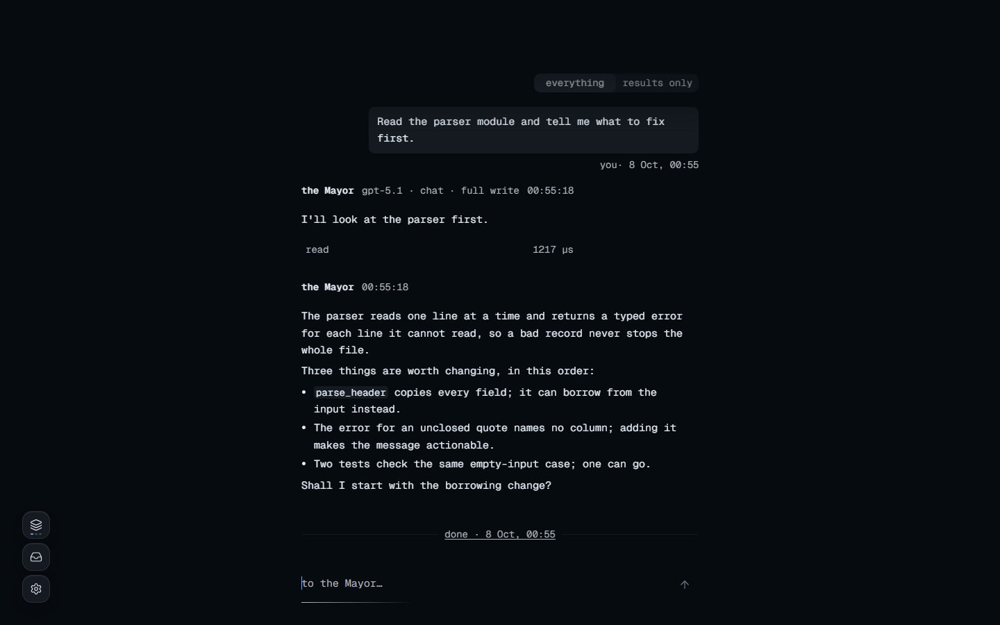

<div align="center">

# sprawling

**Run many agents on your own machine as a city. One Rust binary; the interface is a page in your browser.**

<p align="center">
  <a href="https://crates.io/crates/sprawling"></a>
  <a href="https://www.npmjs.com/package/sprawling"></a>
  <a href="LICENSE"></a>
  <a href="https://github.com/2youg1/sprawling-agents/actions/workflows/ci.yml"></a>
  <a href="https://deepwiki.com/2youg1/sprawling-agents"></a>
</p>

</div>

Give your agents a city to work in. In sprawling, projects become buildings where agents exchange messages, divide the work and keep you informed as it progresses.

Plans, decisions and handoffs live in files. sprawling uses these records to carry long-running work across sessions, organise larger tasks and follow workflows you define. One Rust binary runs locally, serves the browser interface and records the city's history in an append-only Ledger.

<p align="center">
  
  
</p>

**Status: <!-- xtask:begin maturity:word -->alpha<!-- xtask:end -->.** Data formats, the wire and the interface may still change between versions.

中文：[README.zh-CN.md](README.zh-CN.md) · Project introduction: [LLM.md](LLM.md) · Code changes: [AGENTS.md](AGENTS.md)

**Strengths**: small; concepts that are genuinely cool; built for many agents rather than for one agent with extensions bolted on.

**Countless weaknesses**: a student project, funded by no API reseller and maintained by no lab; no anime mascot; I want the WebUI to be good and I am not quite good enough at it yet; stability and usability both still need debugging.

## Quick start

Choose an install channel. npm/Bun and cargo-binstall download prebuilt binaries; `cargo install` compiles locally. The shell installers need no JavaScript or Rust toolchain.

npm, with Node.js and npm installed:

```sh
npm install --global sprawling@latest
```

Bun, with Bun installed:

```sh
bun install --global sprawling@latest
```

crates.io, with the Rust compiler and native build tools required by the published package; with cargo-binstall installed, use `cargo binstall sprawling` to download a release archive:

```sh
cargo install sprawling --locked
```

macOS/Linux shell:

```sh
curl -fsSL https://raw.githubusercontent.com/2youg1/sprawling-agents/main/install.sh | sh
```

Windows PowerShell:

```powershell
irm https://raw.githubusercontent.com/2youg1/sprawling-agents/main/install.ps1 | iex
```

Prebuilt archives support Windows x86-64, macOS on Apple silicon and Linux x86-64. Use the [release list](https://github.com/2youg1/sprawling-agents/releases) for manual downloads and the [installation guide](docs/getting-started.md#1-install) for version selection, verification and source builds with Nix.

After installation, all channels use the same command:

```sh
sprawling up ./cities/first
```

The terminal becomes the city's console and prints the serving address; the browser opens the page. Connect a provider or local model, choose a model for `main`, then tell the Mayor what result you want and what counts as done. The Mayor plans and the buildings' residents execute; you follow progress, answer questions and inspect results. `Ctrl-C` in the console stops the city.

Agents work with full permission inside their building by default: in a building raised from the `minimal` template they may write every file under the building, and their work is not reviewed before it lands. [A building of your own](docs/getting-started.md#a-building-of-your-own) shows how to turn on review and limit writes.

sprawling does not update automatically; check for updates in Settings and follow the [update guide](docs/getting-started.md#updating).

## What it does

**Long-running work and automation.** Plans, decisions and handoffs stay in readable documents, giving agents a record to continue across sessions. Hierarchical plans coordinate larger tasks, while roles, skills and tool integrations let you define the workflow. A standing goal dispatches ready plan nodes and waits for active runs; [daily operation](docs/operating.md) explains how to steer, pause and stop work.

**Social simulation.** Agents can find one another, exchange messages, coordinate work and wait for replies without you relaying each conversation. Your main agent explains the work and reports its progress; the recorded exchanges let you inspect how the group interacts, and [playback](crates/city/skills/playback/SKILL.md) exports a history you can check against the Ledger.

**Easy to start.** Conversations, skills and tool connections follow patterns familiar from other agents. The [getting-started guide](docs/getting-started.md) offers separate routes for agent users moving their configuration and chat users starting their first project, through the first task, reading its report and stopping work.

**Performance.** One process serves the page and runs the city, with no database and no separate service; the city's history is an append-only Ledger on disk. Settings → Performance chooses CPU placement and core priority, and a memory ceiling for each run that only you set, because there is none by default ([choosing how the city uses the machine](docs/performance.md#choose-how-the-city-uses-the-machine)). Commands start below the city's own priority, so a build does not slow the page down. Command output is trimmed according to the command that produced it before it reaches the model, and the full text stays retrievable ([sieve](crates/runtime/spec/Sieve.lean)). The monitor and `sprawling gauge` show run timings, model calls, tokens, cost and resource use on your own hardware, and the [performance register](tools/xtask/budgets.toml) holds the project's budgets and recorded readings ([performance guide](docs/performance.md)).

**Privacy.** A key you paste into a message goes to the vault, and the model sees only a reference to it ([custody](crates/accounting/src/worker/dispatching/custody.rs)). Secret-shaped values in model replies and tool results are replaced by a marker before they reach the permanent history ([redact](crates/runtime/src/redact.rs)). Nothing leaves the machine except the model calls and tools you connect and the default web search, which sends the search words to Exa until you turn it off; a confidential building makes no call to a remote provider. On Windows, Settings offers 88 optional privacy controls, from diagnostic data and speech input to app permissions and Windows AI features. Each one shows its current value, what it changes and what it costs, and is applied or restored one at a time and read back after every write ([Windows privacy controls](docs/operating.md#windows-privacy-controls)). Privacy is not security, and it is not always at odds with convenience, but many of these settings do cost some; the page gives you what you need to weigh each one.

**A history you can replay.** Every decision the city makes is a line in the Ledger, and the same lines replay byte for byte on any machine, because decision paths read time as a parameter, use no random source and keep a fixed order ([determinism](ARCHITECTURE.md#10-determinism-and-hardening)). Tools and model calls are not run again on replay; their recorded results are read back. The city states facts and limits, and leaves the method to the model ([LLM First](ARCHITECTURE.md#llm-first-mechanism-from-the-city-method-from-the-model)).

**Customisation and development.** Define how agents work through role documents, project rules and skills; connect the models and MCP tools your tasks need, with several accounts per provider in the order you choose, or bring a supported harness over ACP. Build another interface against the wire and use the documented seams for runtime changes. These parts suit a workflow or AgentOS that needs persistent project teams, document-based handoffs and a shared history on one machine; [integrations](docs/integrations.md) covers the existing connections, and [architecture](ARCHITECTURE.md#8-where-to-change-what) locates runtime changes.

## Why I built this

I don’t want to sit in front of a computer 24/7 until the 5-hour quota wall hits and I finally go to sleep. Neither do you.

I’ve tried a lot of harnesses. Some feel conceptually outdated; others overshoot what’s actually useful. Take RSI: until the LLM itself leaves the stateless regime, a harness can only keep adapting to the newest models and learning a company’s existing workflows so it can run them faster. The first trend looks like an ablation study; the second needs privacy.

More and more small companies are appearing—tiny teams shipping online services with a large number of agents. Ninety-nine percent of them are a pile of Markdown plus a few talented people.

So I wanted a harness that keeps up with the emerging multi-agent (graph engineering) wave while remaining pragmatic about RSI and memory-related fashion. I put practical extensibility, saving the user’s attention, experimental cost control for agent scale-up, privacy & reliability, and long-running capability at the core of the design, and mixed in a few ideas from urban studies and sociology. That’s how sprawling took shape.

The stronger and larger agents become, the more expensive human attention gets. I refuse to let sprawling become just another app that tries to hijack yours. Unlike most harnesses that obsess over prompt writing, the best way to use sprawling is to shift toward the loop: design the workflow, let agents develop sprawling itself, and hand over your fixed work… so you can focus on designing new business, learning new skills, and only occasionally checking how things are running.

Honestly, no multi-agent scheme yet delivers performance gains that justify the cost of scale. But exploration of this technology for business automation, social simulation, and AI alignment is only just beginning. We still need a lot of effort and resources to study how models interact, collaborate, and exhibit social behavior inside agent clusters.

Agent memory is indeed an important path toward RSI, but not via harness-level injection. Your files, code, and document libraries *are* the memory. Attempts to make an agent truly grow with you are, before LLMs leave the stateless regime, mostly a drag on the model.

If you want to keep a harness you already like, sprawling can bring it in over ACP ([integrations](docs/integrations.md)). kasanagi, which I am preparing now, helps build chat software; later it will work as an MCP server for remote collaboration between several sprawling instances. sprawling is aimed at persistent operations for small teams and at research platforms (computer science or the humanities/social sciences). It is still in R&D. Contributions and conversations are both welcome.

Apart from migrating the necessary business skills / MCP / ACP pieces, I recommend staying lean for now and only adding things manually when you hit a concrete problem. Even the same model behaves completely differently under different harnesses.

My own machine is modest, so I refuse to let multi-agent workloads explode in performance cost. That also makes it suitable for old laptops or cheap cloud boxes.

I don’t sell APIs and I can’t afford a hard drive full of your data, so everything stays local. There is a dedicated confidential building; paired with a local model it is fully usable for private data. The trade-off is that I cannot run enormous-scale tests myself.

## Documentation

| Document | What it holds |
|---|---|
| [`docs/getting-started.md`](docs/getting-started.md) ([中文](docs/getting-started.zh-CN.md)) | The guide for a newcomer: every concept met on the way, from installing to a reviewed merge |
| [`docs/operating.md`](docs/operating.md) | Daily use: steering and stopping work, answering residents, swapping providers and MCP servers, remote access, recovering from failures |
| [`docs/glossary.md`](docs/glossary.md) | One meaning for each word the code, the page and the documents use |
| [`LLM.md`](LLM.md) | Project capabilities, boundaries and reading paths for a model introducing sprawling |
| [`docs/wire.md`](docs/wire.md) | CLI, frames, answers and exit codes for programmatic control |
| [`docs/integrations.md`](docs/integrations.md) | ACP harnesses, MCP tool servers and CLI control from an existing agent |
| [`docs/performance.md`](docs/performance.md) | Monitor readings, reproducible workloads and measurement provenance |
| [`ARCHITECTURE.md`](ARCHITECTURE.md) | The crates and their dependency rules, the seams, one dispatch end to end, what is on disk, how it is verified, and where each kind of change goes |
| [`AGENTS.md`](AGENTS.md) | The rules every change follows and the commands that check them, read first by people and agents alike |
| [`docs/CONTRIBUTING.md`](docs/CONTRIBUTING.md) | Contribution preparation, feature admission and submission, with links to the repository rules |
| [`docs/frontend-method.md`](docs/frontend-method.md) | How a screen is built and accepted, and the approved visual design |
| [`crates/README.md`](crates/README.md) | Every crate, what it owns and where its specification is; each specification, `crates/<dir>/Spec.lean`, holds that crate's interfaces, decisions and proofs, with comments in Chinese |
| [`crates/city/templates/`](crates/city/templates/) | The documents the city writes into each building, which agents read and so can you |
| [`crates/city/skills/`](crates/city/skills/) | The skills that ship with the release |
| [`docs/logging.md`](docs/logging.md) | What goes into the diagnostic log, what goes into the Ledger, and why the two stay apart |
| [`docs/third-party.md`](docs/third-party.md) | The upstream facts this tree follows, credits and licence obligations |
| [`CHANGELOG.md`](CHANGELOG.md) | What each release changed, and what it left known and unfixed |
| [`SECURITY.md`](SECURITY.md) | How to report a vulnerability |

## Sources and credits

Provider interfaces and harness launch commands follow the ACP registry and vendor documentation; where needed, vendor clients supply more precise facts without copying their code. This repository implements its own interface controls, with keyboard behaviour following W3C ARIA Authoring Practices, Kobalte and Ark UI documentation. [Third-party sources](docs/third-party.md) records source versions and full licence obligations.

The shipped `sdd`, `tutor` and `translation` are English adaptations of the author's Chinese skills. `why`, `how` and `blast-radius` adapt Lauren Tan (poteto)'s [pstack](https://github.com/cursor/plugins/tree/main/pstack), and `authority-review` adapts Thermos from the same repository; all four keep MIT. [skills/LICENSES.md](crates/city/skills/LICENSES.md) carries each skill's terms and credit.

Report bugs or request features through the [issue forms](https://github.com/2youg1/sprawling-agents/issues/new/choose). For code changes, follow [AGENTS.md](AGENTS.md) and [CONTRIBUTING](docs/CONTRIBUTING.md). Use the private reporting channel in [SECURITY.md](SECURITY.md) for vulnerabilities.


The project is [MPL-2.0](LICENSE); shipped skills carry their individual licences with their files.
