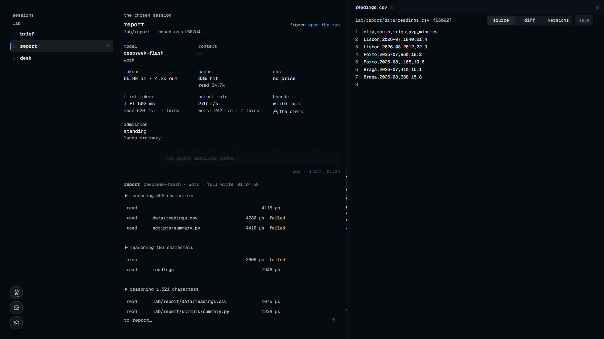
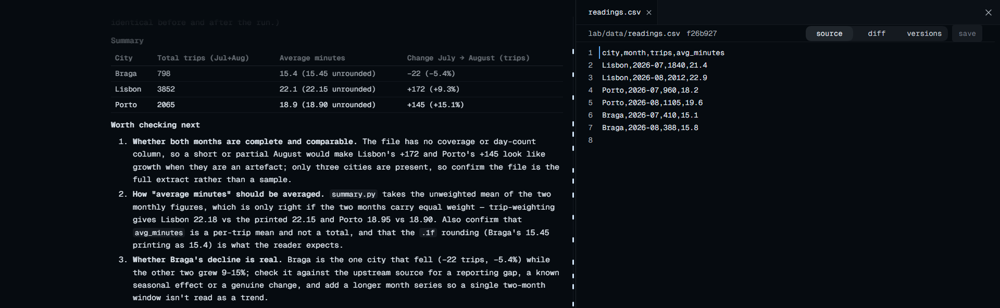

<div align="center">

# sprawling

**让Agent像市民生活在sprawling这座“城市”中，省下你的注意力和时间。**

<p align="center"><a href="README.md">English</a> · <a href="README.zh-CN.md">简体中文</a></p>

<p align="center">
  <a href="https://crates.io/crates/sprawling"></a>
  <a href="https://www.npmjs.com/package/sprawling"></a>
  <a href="LICENSE"></a>
  <a href="https://github.com/2youg1/sprawling-agents/actions/workflows/ci.yml"></a>
  <a href="https://deepwiki.com/2youg1/sprawling-agents"></a>
</p>

</div>

在sprawling里，一座城就是你电脑上的一个目录，项目是城里的一栋栋楼，Agent作为居民住在楼里，互相发消息、分工，做到哪一步会向你汇报。背后只有一个在本地运行的Rust二进制，它给浏览器提供界面，也把城的历史记进一个只追加的Ledger。

这座城不只是个比喻：楼、楼层和房间就是目录树本身，所以一个地址（比如`lab/room1`）同时决定了三件事，Agent能写哪些文件、开工时带着哪些文档、向谁汇报，这三件事本来就是同一个事实，不需要另外的规则让它们保持一致（[词汇表](docs/glossary.md)）。居民是跨run一直存在的身份，真正花钱的是它被派去干活的那一次run，所以城里住着再多居民，闲着的也不花钱。

sprawling尽量少打断你。Agent在自己的楼里默认拥有全部权限，用`minimal`模板盖的楼里每个文件它都能写，干完的活不经审查直接落地（想打开审查或者限制写入，见[一栋你自己的楼](docs/getting-started.zh-CN.md#一栋你自己的楼)），送到你面前等你拍板的，是居民凭楼的规则定不下来的设计问题。计划、决定和交接都写成能直接读的文件，Agent换了会话就从这些记录接着干，记忆就在你的文件、代码和文档库里。目前也不内置workflow，工作流由你用角色、skills和工具接入来定义。

<p align="center">
  
  
  
</p>

**状态：<!-- xtask:begin maturity:word -->alpha<!-- xtask:end -->。** 版本之间数据格式、wire和界面都还可能变。

给要介绍项目的模型读：[LLM.md](LLM.md) · 改代码之前读：[AGENTS.md](AGENTS.md)

**优点**：体积小；概念超级潮酷；面向多Agent，而不是一个Agent挂一圈扩展。

**缺点数不胜数**：不由中转站资助、也不由实验室维护的学生项目；没有二次元形象；WebUI想做好，能力实在差点；功能的稳定性与可用性都还要调。

## 快速开始

先挑一种安装方式。npm/Bun和cargo-binstall下载预编译好的二进制，`cargo install`在本地编译，shell安装脚本不需要JavaScript或Rust工具链。

npm（需要Node.js和npm）：

```sh
npm install --global sprawling@latest
```

Bun（需要Bun）：

```sh
bun install --global sprawling@latest
```

crates.io（需要发布包要求的Rust编译器和对应平台的原生构建工具；装了cargo-binstall的话，可以用`cargo binstall sprawling`直接下载发行归档）：

```sh
cargo install sprawling --locked
```

macOS/Linux shell：

```sh
curl -fsSL https://raw.githubusercontent.com/2youg1/sprawling-agents/main/install.sh | sh
```

Windows PowerShell：

```powershell
irm https://raw.githubusercontent.com/2youg1/sprawling-agents/main/install.ps1 | iex
```

预编译归档支持Windows x86-64、Apple芯片的macOS和Linux x86-64。想手动下载就去[发行列表](https://github.com/2youg1/sprawling-agents/releases)；怎么选版本、怎么校验、怎么用Nix从源码构建，见[安装指南](docs/getting-started.zh-CN.md#1-安装)。

不管用哪种方式装，启动都是同一条命令：

```sh
sprawling up ./cities/first
```

终端会变成这座城的控制台并打印服务地址，浏览器会打开页面。在页面上接一个provider或者本地模型，给`main`选一个模型，然后告诉Mayor你要什么结果、做到什么程度算完。Mayor负责规划，楼里的居民负责执行，你这边看进展、回答它们的提问、检查结果。想停城就在控制台按`Ctrl-C`。

sprawling不会自动更新，需要的时候在设置里检查版本，再按[更新指南](docs/getting-started.zh-CN.md#更新)操作。

对话、skills和工具接入的用法都和其他Agent差不多。[上手指南](docs/getting-started.zh-CN.md)给两种人各准备了一条路线：已经在用其他Agent的人迁移配置，只用过Chat的人从第一次干活开始；路线一直讲到第一个任务、看报告和停下工作。

## 能做什么

### 长程任务与自动化

更大的任务用分层计划来协调，Mayor把想法写成路线图，再通过`plan`把每栋楼的那一份交下去。设下一个常驻目标后，它会把已经就绪的计划节点派出去，同时等着正在跑的run；怎么引导、暂停和停止这些工作，见[日常操作](docs/operating.md)。

### 社会模拟

Agent之间可以互相找到对方、发消息、协调任务、等回复，不用你一遍遍转述。主Agent负责向你解释工作、汇报进展；这些通信都有记录，你可以看这群Agent到底怎么互动，用[playback](crates/city/skills/playback/SKILL.md)还能把历史导出来，再和Ledger对照检查。

### 性能

提供页面和运行整座城的是同一个进程，没有数据库，也没有另外的服务，城的历史就是磁盘上一个只追加的Ledger。在设置→性能里可以选CPU怎么放置、核心优先级多高，也可以给每个run设一个内存上限；这个上限默认没有，只能由你自己填（[城怎样使用你的硬件](docs/performance.md#choose-how-the-city-uses-the-machine)）。命令以比城本身更低的优先级启动，所以跑一次构建不会把页面拖慢。命令的输出在交给模型之前，会按产生它的那条命令来裁剪，完整的原文之后仍然取得回来（[sieve](crates/runtime/spec/Sieve.lean)）。监视器和`sprawling gauge`会在你自己的硬件上显示run的耗时、模型调用、token、成本和资源占用，项目的预算和已有读数记在[性能登记表](tools/xtask/budgets.toml)里（[性能文档](docs/performance.md)）。

### 隐私

你在消息里贴的Key会先进Vault，模型看到的只是它的引用（[custody](crates/accounting/src/worker/dispatching/custody.rs)）。模型回复和工具结果里长得像密钥的值，写进永久历史之前会被换成一个标记（[redact](crates/runtime/src/redact.rs)）。除了你接入的模型调用和工具，再加上默认开着的网页搜索（关掉之前它会把搜索词发给Exa），没有东西会离开你的电脑；保密楼则不调用任何远程provider。在Windows上，设置里有88项可选的隐私控制，从诊断数据、语音输入到应用权限和Windows AI功能都有。每一项都显示当前值、它改什么、代价是什么，可以一项一项应用或恢复，每次写入后都会读回来核对（[Windows隐私控制](docs/operating.md#windows-privacy-controls)）。隐私不等于安全，也不一定和便利冲突，但这里面很多设置确实要牺牲一些便利，页面把每一项的信息都摆出来，由你自己逐项权衡。

### 可重放的历史

城做的每一个决定都是Ledger里的一行，这些行拿到任何一台机器上重放，结果都逐字节相同，因为决策路径把时间当作参数传进来、不用随机源、顺序也固定（[确定性](ARCHITECTURE.md#10-determinism-and-hardening)）。重放时不会再执行一遍工具或调用模型，而是把当时记下的结果读回来。城只负责给出事实和边界，具体怎么做交给模型（[LLM First](ARCHITECTURE.md#llm-first-mechanism-from-the-city-method-from-the-model)）。

### 定制与二次开发

Agent怎么工作，由角色文档、项目规则和skills来定义；需要什么模型和MCP工具就接什么（同一个provider可以登记多个账号，按你定的优先顺序使用），也可以通过ACP接入支持的Harness。你可以基于wire做一套自己的界面，也可以沿着架构里的seams去改运行机制。如果你的工作流或AgentOS需要常驻的项目团队、靠文档交接、在同一台电脑上共享历史，这些部件都可以拿来搭；现有的接入方式见[接入文档](docs/integrations.md)，运行机制该改哪里见[架构](ARCHITECTURE.md#8-where-to-change-what)。

## 为什么做它

我不想24/7守在电脑面前，直到5h额度撞墙再去睡觉，你也不想。

我换过很多Harness，有些理念落后，有些超出实际：就以RSI来说，在LLM本身脱离无状态之前，Harness能做的只是不断地针对最新的模型做适配和学习公司的现有业务流程并更高速地运行，前者的趋势是消融实验，后者则需要隐私。

越来越多的小规模公司正在出现，它们是有着大量Agent开发在线服务的小型团队，其中99%就是Markdown集+几个天才。

因而我想要制作一个跟上新生的多Agent（Graph engineering）又同时能务实地处理RSI和记忆相关概念风潮的Harness，我将务实的可拓展、节省用户精力、实验性的agent规模化的成本控制、隐私与可靠性、长时运行能力这些放在了设计的核心，并结合了一些城市学与社会学的内容设计了sprawling。

Agent的能力和规模越强，人的注意力就越贵，我不想sprawling成为无数希望劫持你注意力应用中的一个。sprawling区别于常规Hanress聚焦于编写Prompt，最佳使用实践应是转向Loop，安排工作流，让Agent开发sprawling，接管你的固定工作……让你本人专注于新业务的设计，新技能的学习，偶尔回来看一眼跑的怎么样。

诚实地说目前还没有一种多Agent方案提升的性能对得起规模化提升的成本，但探索这项技术在自动化业务，社会模拟以及AI对齐方面的研究刚刚起步，我们还需要花费很多精力和资源探索Agent集群场景下模型的交互行为、协作效率与社会性表现。

Agent记忆的确是实现RSI很重要的途径，但不是依靠Harness做注入，你的文件、代码，文档库就是记忆，Agent真正和你一起成长的尝试在LLM脱离无状态之前大多是对模型的拖累。

如果你想继续用自己喜欢的Harness，sprawling已经支持通过ACP接入（[接入文档](docs/integrations.md)）。我正在准备开发的kasanagi是一个辅助搭建聊天软件的项目，以后会作为MCP解决多个sprawling实例之间的远程协作。sprawling主要面向为小团队持久化运营和学术（无论计算机还是人文社科）研究平台，目前还处于研究与开发阶段，欢迎一起开发，也欢迎和我联系/讨论。

除了迁移必要的业务skill/MCP/ACP之外，推荐暂时保持精简，在使用中遇到问题时再手动追加内容，即使是相同的模型搭配不同的Harness都会有完全不同的行为。

我用的电脑不好，所以我不会放任多Agent产生性能开销指数增长的问题，也适合部署在你的旧电脑或云电脑上。

我不卖API也买不起装你信息的硬盘，因而数据都留在本地，我设计了专门的保密楼，配上本地模型完全可以用于处理隐私数据，但这也意味着我没法运行巨大规模的测试。

## 文档

除了两版README、两版上手指南和crate规格里的注释，其他文档都是英文。

| 文档 | 内容 |
|---|---|
| [`docs/getting-started.zh-CN.md`](docs/getting-started.zh-CN.md)（[English](docs/getting-started.md)） | 给新手的指南：从安装一直到一次审过的合并，路上遇到的每个概念都会讲到 |
| [`docs/operating.md`](docs/operating.md) | 日常使用：引导和停下工作、回答居民、换provider和MCP server、远程访问，以及出了问题怎么办 |
| [`docs/glossary.md`](docs/glossary.md) | 代码、页面和文档里用到的每个词，每个词只有一个意思 |
| [`LLM.md`](LLM.md) | 写给要介绍sprawling的模型：能做什么、边界在哪、按什么顺序读 |
| [`docs/wire.md`](docs/wire.md) | 用程序控制城时的CLI、帧、回答和退出码 |
| [`docs/integrations.md`](docs/integrations.md) | ACP Harness、MCP工具服务，以及从已有Agent通过CLI控制城 |
| [`docs/performance.md`](docs/performance.md) | 监视器的读数、可复现的负载和测量数据的来源 |
| [`ARCHITECTURE.md`](ARCHITECTURE.md) | 各个crate和它们之间的依赖规则、seams、一次派活从头到尾怎么走、磁盘上有什么、怎么验证、每类改动该去哪里 |
| [`AGENTS.md`](AGENTS.md) | 每次改动都要守的规则和检查它们的命令，人和Agent都先读它 |
| [`docs/CONTRIBUTING.md`](docs/CONTRIBUTING.md) | 贡献前的准备、功能准入和提交流程，以及仓库规则的入口 |
| [`docs/frontend-method.md`](docs/frontend-method.md) | 一个屏怎么搭、怎么验收，以及已经批准的视觉设计 |
| [`crates/README.md`](crates/README.md) | 每个crate管什么、规格在哪；规格`crates/<dir>/Spec.lean`写着这个crate的接口、决定和证明，注释用中文 |
| [`crates/city/templates/`](crates/city/templates/) | 城写进每栋楼的文档，Agent会读，你也可以读 |
| [`crates/city/skills/`](crates/city/skills/) | 随发行一起分发的skill |
| [`docs/logging.md`](docs/logging.md) | 什么进诊断日志、什么进Ledger，以及两者为什么要分开 |
| [`docs/third-party.md`](docs/third-party.md) | 本仓库跟随的上游事实、致谢和许可义务 |
| [`CHANGELOG.md`](CHANGELOG.md) | 每一版改了什么，以及还留着哪些已知但没修的问题 |
| [`SECURITY.md`](SECURITY.md) | 怎么报告漏洞 |

## 来源与致谢

厂商接口和Harness的启动方式跟随ACP registry和厂商文档；需要精确核对的地方，从厂商客户端里读取事实，但不复制它们的代码。界面控件由本仓库自己实现，键盘行为参照W3C ARIA Authoring Practices、Kobalte和Ark UI的文档。来源版本和完整许可见[third-party](docs/third-party.md)。

随附的`sdd`、`tutor`、`translation`是作者中文skills的英文改编版；`why`、`how`、`blast-radius`改编自Lauren Tan（poteto）的[pstack](https://github.com/cursor/plugins/tree/main/pstack)，`authority-review`改编自同一仓库的Thermos，这四个都保留MIT许可。每个skill的署名和许可见[skills/LICENSES.md](crates/city/skills/LICENSES.md)。

报告缺陷或者提功能请求，请用[Issue表单](https://github.com/2youg1/sprawling-agents/issues/new/choose)。改代码请按[AGENTS.md](AGENTS.md)和[CONTRIBUTING](docs/CONTRIBUTING.md)来。漏洞请走[SECURITY.md](SECURITY.md)里的私密报告渠道。

本项目采用[MPL-2.0](LICENSE)许可；随附skills的许可各自跟着文件分发。
